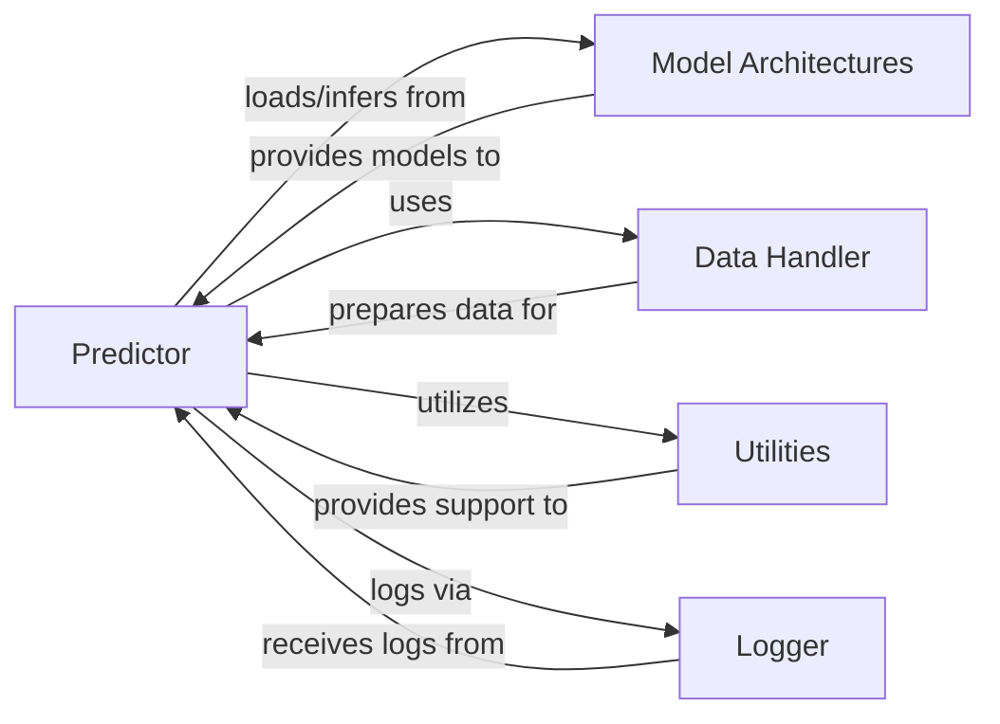

## Details

The `Prediction & Inference` subsystem is designed to efficiently utilize a trained deep learning model to generate predictions on new data. It encapsulates the entire workflow from data preparation to final output, ensuring a robust and observable inference process.

### Predictor
This is the central orchestrator of the inference process. It is responsible for loading pre-trained model weights, preparing input data for prediction, executing the forward pass through the neural network, and generating the final prediction results. It also handles specific aspects like processing different allele types and, if configured, compiling attention weights for interpretability.

**Related Classes/Methods**:

- <a href="https://github.com/pfizer-opensource/HLAIIPred/blob/main/hlapred/predict.py#L1-L1" target="_blank" rel="noopener noreferrer">`hlapred/predict.py` (1:1)</a>

### Model Architectures
Defines the neural network architectures used for prediction. This includes the specific layers, attention mechanisms (e.g., `DeConvolutionalAttention`), and overall model structure that the `Predictor` will instantiate and use.

**Related Classes/Methods**:

- <a href="https://github.com/pfizer-opensource/HLAIIPred/blob/main/hlapred/model_modules.py#L1-L1" target="_blank" rel="noopener noreferrer">`hlapred/model_modules.py` (1:1)</a>

### Data Handler
Manages the preparation of raw input data into the correct format required by the model and creates `DataLoader` instances for efficient batch processing during inference. It ensures data integrity and optimal delivery to the model.

**Related Classes/Methods**:

- <a href="https://github.com/pfizer-opensource/HLAIIPred/blob/main/hlapred/dataset.py#L1-L1" target="_blank" rel="noopener noreferrer">`hlapred/dataset.py` (1:1)</a>

### Utilities
A collection of reusable helper functions and constants that support various operations across the project. This includes tasks like configuration parsing, data transformations, and general computations that are leveraged by other components.

**Related Classes/Methods**:

- <a href="https://github.com/pfizer-opensource/HLAIIPred/blob/main/hlapred/utils.py#L1-L1" target="_blank" rel="noopener noreferrer">`hlapred/utils.py` (1:1)</a>

### Logger
Provides a centralized mechanism for recording events, progress, warnings, and errors during the prediction process. It is crucial for monitoring the system's behavior, debugging issues, and ensuring traceability.

**Related Classes/Methods**:

- <a href="https://github.com/pfizer-opensource/HLAIIPred/blob/main/hlapred/logger.py#L1-L1" target="_blank" rel="noopener noreferrer">`hlapred/logger.py` (1:1)</a>

### [FAQ](https://github.com/CodeBoarding/GeneratedOnBoardings/tree/main?tab=readme-ov-file#faq)