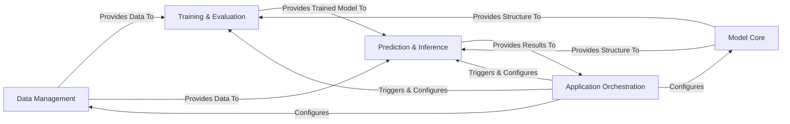

## Details

One paragraph explaining the functionality which is represented by this graph. What the main flow is and what is its purpose.

### Data Management [[Expand]](./Data_Management.md)
Responsible for loading, preprocessing, and encoding raw biological sequence data into a numerical format suitable for deep learning models. It ensures data integrity and prepares it for consumption by the model training and inference processes.

**Related Classes/Methods**:

- <a href="https://github.com/pfizer-opensource/HLAIIPred/blob/main/hlapred/dataset.py#L1-L1" target="_blank" rel="noopener noreferrer">`hlapred/dataset.py` (1:1)</a>
- <a href="https://github.com/pfizer-opensource/HLAIIPred/blob/main/hlapred/utils.py#L39-L75" target="_blank" rel="noopener noreferrer">`hlapred/utils.py:get_encoding` (39:75)</a>

### Model Core
Defines the neural network architecture, including its various layers, attention mechanisms, and configurable building blocks (e.g., EncoderBlock, DecoderBlock). It provides the blueprint for the deep learning model.

**Related Classes/Methods**:

- <a href="https://github.com/pfizer-opensource/HLAIIPred/blob/main/hlapred/model_modules.py#L1-L1" target="_blank" rel="noopener noreferrer">`hlapred/model_modules.py` (1:1)</a>

### Training & Evaluation
Orchestrates the entire model training lifecycle. This includes instantiating the model, setting up optimizers and loss functions, managing the training loop (forward/backward passes), performing periodic evaluations, and saving trained model states.

**Related Classes/Methods**:

- `hlapred/train.py` (1:1)

### Prediction & Inference [[Expand]](./Prediction_Inference.md)
Manages the process of using a trained model to make predictions on new, unseen data. It handles loading trained model weights, preparing input for inference, executing the forward pass through the model, and outputting the prediction results.

**Related Classes/Methods**:

- <a href="https://github.com/pfizer-opensource/HLAIIPred/blob/main/hlapred/predict.py#L1-L1" target="_blank" rel="noopener noreferrer">`hlapred/predict.py` (1:1)</a>

### Application Orchestration [[Expand]](./Application_Orchestration.md)
Serves as the primary control point for the application. It handles configuration loading, parses command-line arguments, and orchestrates the execution of training or prediction workflows by interacting with other core components.

**Related Classes/Methods**:

- `models/config.yaml` (1:1)
- `cli/HLAIIPred` (1:1)

### [FAQ](https://github.com/CodeBoarding/GeneratedOnBoardings/tree/main?tab=readme-ov-file#faq)