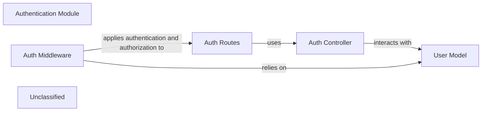

## Details

The Authentication Module is a critical subsystem within the HR-SM project, responsible for securing user access and managing identity. It encompasses the core functionalities for user authentication, authorization, and password management. This module ensures that only legitimate and authorized users can access system resources, maintaining data integrity and security.

### Authentication Module [[Expand]](./Authentication_Module.md)
The overarching module responsible for managing all aspects of user authentication and authorization within the HR-SM system. This includes user registration, secure login, password management, JWT-based session management, and role-based access control (RBAC).

**Related Classes/Methods**:

- <a href="https://github.com/Haitham0Reda/HR-SM/blob/master/server/routes/auth.routes.js" target="_blank" rel="noopener noreferrer">`server/routes/auth.routes.js`</a>
- <a href="https://github.com/Haitham0Reda/HR-SM/blob/master/server/controller/auth.controller.js" target="_blank" rel="noopener noreferrer">`server/controller/auth.controller.js`</a>
- <a href="https://github.com/Haitham0Reda/HR-SM/blob/master/server/middleware/authMiddleware.js" target="_blank" rel="noopener noreferrer">`server/middleware/authMiddleware.js`</a>
- <a href="https://github.com/Haitham0Reda/HR-SM/blob/master/server/models/user.model.js" target="_blank" rel="noopener noreferrer">`server/models/user.model.js`</a>

### Auth Routes
Defines the API endpoints that clients interact with for authentication operations, specifically for password management (forgot password, reset password, verify reset token). It maps incoming HTTP requests to the appropriate controller functions.

**Related Classes/Methods**:

- <a href="https://github.com/Haitham0Reda/HR-SM/blob/master/server/routes/auth.routes.js" target="_blank" rel="noopener noreferrer">`server/routes/auth.routes.js`</a>

### Auth Controller
Contains the core business logic for handling authentication requests related to password management. This includes validating user input, generating and verifying reset tokens, sending password reset emails, and interacting with the `User Model` to update user credentials.

**Related Classes/Methods**:

- <a href="https://github.com/Haitham0Reda/HR-SM/blob/master/server/controller/auth.controller.js" target="_blank" rel="noopener noreferrer">`server/controller/auth.controller.js`</a>

### Auth Middleware
Functions as an interceptor for protected API routes. Its primary responsibilities include verifying the authenticity and validity of JWTs present in incoming requests, authenticating the user associated with the token, and enforcing authorization rules based on the user's assigned roles. It relies on the `User Model` to retrieve user details for verification.

**Related Classes/Methods**:

- <a href="https://github.com/Haitham0Reda/HR-SM/blob/master/server/middleware/authMiddleware.js" target="_blank" rel="noopener noreferrer">`server/middleware/authMiddleware.js`</a>

### User Model
The Mongoose schema and model representing user data within the MongoDB database. It defines the structure for user credentials (e.g., username, hashed password), roles, and password reset fields. It also includes pre-save hooks for password hashing and methods for password comparison and permission management.

**Related Classes/Methods**:

- <a href="https://github.com/Haitham0Reda/HR-SM/blob/master/server/models/user.model.js" target="_blank" rel="noopener noreferrer">`server/models/user.model.js`</a>

### Unclassified
Component for all unclassified files and utility functions (Utility functions/External Libraries/Dependencies)

**Related Classes/Methods**: _None_

### [FAQ](https://github.com/CodeBoarding/GeneratedOnBoardings/tree/main?tab=readme-ov-file#faq)