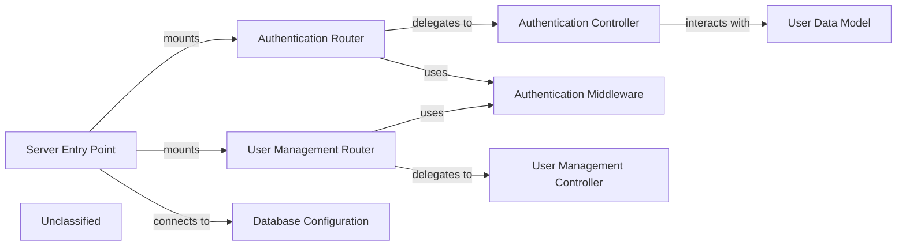

## Details

The HR-SM backend system is structured around a clear separation of concerns, with the `Server Entry Point` acting as the central orchestrator. This entry point initializes the Express.js application, configures essential middleware, and establishes the crucial connection to the MongoDB database via the `Database Configuration` component. Authentication and user management functionalities are handled by dedicated `Authentication Router` and `User Management Router` components, respectively. These routers define the API endpoints and delegate business logic to their corresponding `Authentication Controller` and `User Management Controller`. The `Authentication Middleware` plays a vital role in securing routes by verifying user authenticity and authorization. All user-related data persistence is managed through the `User Data Model`, which defines the schema and interacts directly with the MongoDB database. This architecture ensures a modular, maintainable, and scalable backend for the HR-SM application.

### Server Entry Point
Initializes the Express.js application, configures global middleware (e.g., body-parser, CORS), establishes the connection to the Database (MongoDB), and mounts all API route modules. It is the main orchestrator of the server's lifecycle.

**Related Classes/Methods**:

- <a href="https://github.com/Haitham0Reda/HR-SM/blob/master/server/index.js" target="_blank" rel="noopener noreferrer">`server/index.js`</a>

### Authentication Router
Defines the RESTful API endpoints specifically for user authentication and authorization (e.g., `/api/auth/register`, `/api/auth/login`, `/api/auth/logout`). It maps these routes to corresponding controller functions.

**Related Classes/Methods**:

- <a href="https://github.com/Haitham0Reda/HR-SM/blob/master/server/routes/auth.routes.js" target="_blank" rel="noopener noreferrer">`server/routes/auth.routes.js`</a>

### Authentication Controller
Implements the core business logic for user authentication. This includes user registration, login, password hashing, JWT token generation and validation, and session management.

**Related Classes/Methods**:

- <a href="https://github.com/Haitham0Reda/HR-SM/blob/master/server/controller/auth.controller.js" target="_blank" rel="noopener noreferrer">`server/controller/auth.controller.js`</a>

### Authentication Middleware
Provides middleware functions to protect API routes. This typically involves verifying JWT tokens from incoming requests to ensure user authenticity and authorization before allowing access to protected resources.

**Related Classes/Methods**:

- <a href="https://github.com/Haitham0Reda/HR-SM/blob/master/server/middleware/authMiddleware.js" target="_blank" rel="noopener noreferrer">`server/middleware/authMiddleware.js`</a>

### User Data Model
Defines the Mongoose schema and model for the User entity, representing how user data is structured and stored in the Database (MongoDB). It provides an interface for CRUD operations on user records.

**Related Classes/Methods**:

- <a href="https://github.com/Haitham0Reda/HR-SM/blob/master/server/models/user.model.js" target="_blank" rel="noopener noreferrer">`server/models/user.model.js`</a>

### User Management Router
Defines API endpoints for managing user profiles (e.g., `/api/users`, `/api/users/:id`).

**Related Classes/Methods**:

- <a href="https://github.com/Haitham0Reda/HR-SM/blob/master/server/routes/user.routes.js" target="_blank" rel="noopener noreferrer">`server/routes/user.routes.js`</a>

### User Management Controller
Implements the business logic for user-related operations (e.g., adding, updating, deleting, retrieving user records).

**Related Classes/Methods**:

- <a href="https://github.com/Haitham0Reda/HR-SM/blob/master/server/controller/user.controller.js" target="_blank" rel="noopener noreferrer">`server/controller/user.controller.js`</a>

### Database Configuration
Manages the connection to the Database (MongoDB) using Mongoose, handling connection establishment and error handling.

**Related Classes/Methods**:

- <a href="https://github.com/Haitham0Reda/HR-SM/blob/master/server/config/db.js" target="_blank" rel="noopener noreferrer">`server/config/db.js`</a>

### Unclassified
Component for all unclassified files and utility functions (Utility functions/External Libraries/Dependencies)

**Related Classes/Methods**: _None_

### [FAQ](https://github.com/CodeBoarding/GeneratedOnBoardings/tree/main?tab=readme-ov-file#faq)