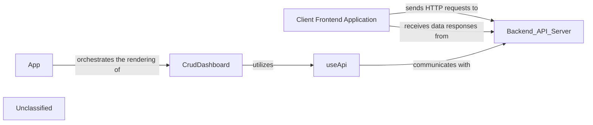

## Details

The HR-SM system's client-side architecture is centered around the Client Frontend Application, a React-based interface that provides comprehensive user interaction and data visualization. The App component serves as the application's entry point, managing global state, routing, and overall layout. Key functional areas, such as data management for various HR entities, are handled by components like CrudDashboard, which leverage the reusable useApi hook to abstract and streamline all interactions with the Backend API Server. This server, an external but integral component, provides the necessary data and business logic via a RESTful API, enabling the frontend to perform CRUD operations and maintain a dynamic user experience.

### Client Frontend Application [[Expand]](./Client_Frontend_Application.md)
The primary user interface for the HR-SM system, built with React and Material-UI. It handles user interaction, data display, API communication, client-side routing, and state management, presenting various HR modules.

**Related Classes/Methods**:

- <a href="https://github.com/Haitham0Reda/HR-SM/blob/master/client/src/App.js" target="_blank" rel="noopener noreferrer">`App`</a>
- <a href="https://github.com/Haitham0Reda/HR-SM/blob/master/client/src/CrudDashboard.js" target="_blank" rel="noopener noreferrer">`CrudDashboard`</a>
- <a href="https://github.com/Haitham0Reda/HR-SM/blob/master/client/src/hooks/useApi.js" target="_blank" rel="noopener noreferrer">`useApi`</a>

### App
The root component of the React application, responsible for overall layout, global state, and defining the main routing structure.

**Related Classes/Methods**:

- <a href="https://github.com/Haitham0Reda/HR-SM/blob/master/client/src/App.js" target="_blank" rel="noopener noreferrer">`App`</a>

### CrudDashboard
A generic or specialized component for displaying and managing data in a tabular or card-based format, facilitating Create, Read, Update, and Delete (CRUD) operations for various HR entities.

**Related Classes/Methods**:

- <a href="https://github.com/Haitham0Reda/HR-SM/blob/master/client/src/CrudDashboard.js" target="_blank" rel="noopener noreferrer">`CrudDashboard`</a>

### useApi
A custom React hook that encapsulates the logic for making API calls to the backend, handling loading states, errors, and data parsing, promoting reusability and separation of concerns.

**Related Classes/Methods**:

- <a href="https://github.com/Haitham0Reda/HR-SM/blob/master/client/src/hooks/useApi.js" target="_blank" rel="noopener noreferrer">`useApi`</a>

### Unclassified
Component for all unclassified files and utility functions (Utility functions/External Libraries/Dependencies)

**Related Classes/Methods**: _None_

### [FAQ](https://github.com/CodeBoarding/GeneratedOnBoardings/tree/main?tab=readme-ov-file#faq)