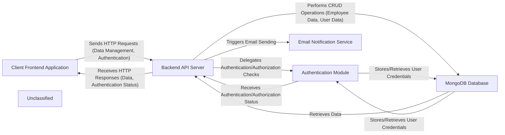

## Details

The HR-SM application follows a client-server architecture, with a React-based frontend interacting with a Node.js/Express.js backend. The backend provides RESTful APIs for managing HR-related data, authenticating users, and integrating with a MongoDB database for persistent storage. An Email Notification Service is integrated into the backend to handle various communication needs. This setup ensures a clear separation of concerns, allowing for independent development and scaling of the frontend and backend components.

### Client Frontend Application [[Expand]](./Client_Frontend_Application.md)
The user-facing interface, built with React and Material-UI, responsible for user interaction, data display, and making API requests. It handles routing, state management, and presents various HR modules to the user.

**Related Classes/Methods**:

- <a href="https://github.com/Haitham0Reda/HR-SM/blob/master/client/src/App.js" target="_blank" rel="noopener noreferrer">`App.js`</a>
- <a href="https://github.com/Haitham0Reda/HR-SM/blob/master/client/src/CrudDashboard.js" target="_blank" rel="noopener noreferrer">`CrudDashboard.js`</a>
- <a href="https://github.com/Haitham0Reda/HR-SM/blob/master/client/src/hooks/useApi.js" target="_blank" rel="noopener noreferrer">`useApi`</a>

### Backend API Server [[Expand]](./Backend_API_Server.md)
The central Node.js/Express.js application that exposes RESTful APIs, implements business logic, and orchestrates interactions with the database and other services. It acts as the primary interface for all data operations and business processes.

**Related Classes/Methods**:

- <a href="https://github.com/Haitham0Reda/HR-SM/blob/master/server/index.js" target="_blank" rel="noopener noreferrer">`index.js`</a>
- <a href="https://github.com/Haitham0Reda/HR-SM/blob/master/server/routes/auth.routes.js" target="_blank" rel="noopener noreferrer">`authRoutes`</a>
- <a href="https://github.com/Haitham0Reda/HR-SM/blob/master/server/controller/auth.controller.js" target="_blank" rel="noopener noreferrer">`authController`</a>

### Authentication Module [[Expand]](./Authentication_Module.md)
A dedicated module within the backend responsible for user authentication, authorization, and JWT management. It handles user login, registration, password resets, and role-based access control.

**Related Classes/Methods**:

- <a href="https://github.com/Haitham0Reda/HR-SM/blob/master/server/routes/auth.routes.js" target="_blank" rel="noopener noreferrer">`authRoutes`</a>
- <a href="https://github.com/Haitham0Reda/HR-SM/blob/master/server/controller/auth.controller.js" target="_blank" rel="noopener noreferrer">`authController`</a>
- <a href="https://github.com/Haitham0Reda/HR-SM/blob/master/server/middleware/authMiddleware.js" target="_blank" rel="noopener noreferrer">`protect`</a>
- <a href="https://github.com/Haitham0Reda/HR-SM/blob/master/server/models/user.model.js" target="_blank" rel="noopener noreferrer">`User`</a>

### MongoDB Database
The NoSQL database used for persistent storage of all application data, including employee records, user accounts, and various HR-related entities.

**Related Classes/Methods**:

- <a href="https://github.com/Haitham0Reda/HR-SM/blob/master/server/config/db.js" target="_blank" rel="noopener noreferrer">`connectDB`</a>
- <a href="https://github.com/Haitham0Reda/HR-SM/blob/master/server/models/user.model.js" target="_blank" rel="noopener noreferrer">`User`</a>

### Email Notification Service
An integrated service within the backend responsible for sending various email notifications (e.g., password resets, account confirmations, leave requests).

**Related Classes/Methods**:

- <a href="https://github.com/Haitham0Reda/HR-SM/blob/master/server/utils/emailService.js" target="_blank" rel="noopener noreferrer">`sendEmail`</a>

### Unclassified
Component for all unclassified files and utility functions (Utility functions/External Libraries/Dependencies)

**Related Classes/Methods**: _None_

### [FAQ](https://github.com/CodeBoarding/GeneratedOnBoardings/tree/main?tab=readme-ov-file#faq)