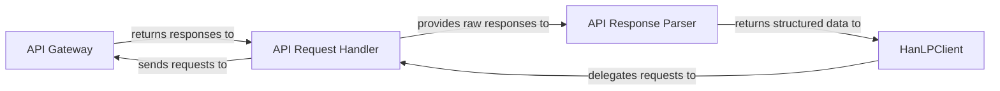

## Details

The `hanlp_restful` subsystem acts as a client-side interface for the HanLP RESTful API. The central `HanLPClient` component provides a user-friendly abstraction for various NLP tasks. It orchestrates interactions by delegating the preparation and transmission of HTTP requests to the `API Request Handler`. These requests are then sent to the external `API Gateway`, which represents the server-side HanLP API. Upon receiving responses, the `API Request Handler` passes them to the `API Response Parser`, which deserializes the data and transforms it into structured Python objects, ultimately returning them to the `HanLPClient` for consumption by the end application. This clear separation of concerns ensures efficient and robust communication with the HanLP services.

### API Gateway [[Expand]](./API_Gateway.md)
The external HanLP RESTful API server that the `hanlp_restful` client library interacts with. It acts as the primary entry point for all incoming client requests, routing them to the appropriate internal NLP services on the server-side. This component is external to the `plugins.hanlp_restful.hanlp_restful` subsystem.

**Related Classes/Methods**: _None_

### HanLPClient
The primary user-facing client-side component within the `hanlp_restful` subsystem. It provides a high-level, object-oriented interface for applications to access various HanLP NLP services via RESTful API calls. It abstracts the complexities of underlying HTTP communication and response handling, offering a simplified way to interact with the HanLP server.

**Related Classes/Methods**:

- <a href="https://github.com/hankcs/HanLP/blob/master/plugins/hanlp_restful/hanlp_restful/__init__.py" target="_blank" rel="noopener noreferrer">`plugins.hanlp_restful.hanlp_restful.HanLPClient`</a>

### API Request Handler
A client-side component responsible for managing the low-level details of preparing, serializing, and sending HTTP requests to the HanLP RESTful API. It handles the conversion of Python data into appropriate request formats (e.g., JSON) and the actual network transmission. This component is primarily implemented through methods within the `HanLPClient` class and a module-level helper function.

**Related Classes/Methods**:

- <a href="https://github.com/hankcs/HanLP/blob/master/plugins/hanlp_restful/hanlp_restful/__init__.py" target="_blank" rel="noopener noreferrer">`plugins.hanlp_restful.hanlp_restful.HanLPClient._send_post_json`</a>
- <a href="https://github.com/hankcs/HanLP/blob/master/plugins/hanlp_restful/hanlp_restful/__init__.py" target="_blank" rel="noopener noreferrer">`plugins.hanlp_restful.hanlp_restful.HanLPClient._send_get_json`</a>
- <a href="https://github.com/hankcs/HanLP/blob/master/plugins/hanlp_restful/hanlp_restful/__init__.py" target="_blank" rel="noopener noreferrer">`plugins.hanlp_restful.hanlp_restful._post`</a>
- <a href="https://github.com/hankcs/HanLP/blob/master/plugins/hanlp_restful/hanlp_restful/__init__.py" target="_blank" rel="noopener noreferrer">`plugins.hanlp_restful.hanlp_restful.HanLPClient._fire_request`</a>

### API Response Parser
A client-side component dedicated to deserializing and interpreting the raw JSON responses received from the HanLP API Gateway. Its primary role is to transform these raw responses into structured and usable Python objects, such as `hanlp_common.document.Document` or other native Python data types, for consumption by the `HanLPClient`. This functionality is embedded within the request handling methods.

**Related Classes/Methods**:

- <a href="https://github.com/hankcs/HanLP/blob/master/" target="_blank" rel="noopener noreferrer">`plugins.hanlp_restful.hanlp_restful.HanLPClient._send_post_json`</a>
- <a href="https://github.com/hankcs/HanLP/blob/master/" target="_blank" rel="noopener noreferrer">`plugins.hanlp_restful.hanlp_restful.HanLPClient._send_get_json`</a>
- <a href="https://github.com/hankcs/HanLP/blob/master/plugins/hanlp_common/hanlp_common/document.py#L17-L546" target="_blank" rel="noopener noreferrer">`hanlp_common.document.Document`:17-546</a>

### [FAQ](https://github.com/CodeBoarding/GeneratedOnBoardings/tree/main?tab=readme-ov-file#faq)