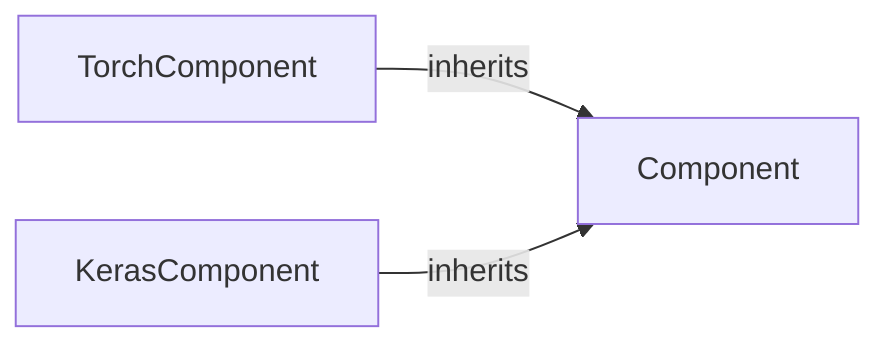

## Details

The `Base Component Framework` subsystem establishes the foundational structure for all pluggable NLP modules within HanLP, ensuring a consistent interface and lifecycle management through an inheritance hierarchy.

### Component
This is the foundational abstract base class for all NLP components in HanLP. It defines the essential lifecycle methods (e.g., `__init__`, `predict`, `train`, `save`, `load`) and a consistent interface that all concrete components must adhere to, regardless of their underlying deep learning framework. It acts as the blueprint for any pluggable NLP module.

**Related Classes/Methods**:

- <a href="https://github.com/hankcs/HanLP/blob/master/hanlp/common/component.py#L11-L36" target="_blank" rel="noopener noreferrer">`hanlp.common.component.Component`:11-36</a>

### TorchComponent
A concrete implementation of the `Component` interface specifically tailored for PyTorch-based NLP models. It extends the base component's lifecycle management to include PyTorch-specific concerns such as device management (CPU/GPU), model serialization/deserialization using PyTorch's mechanisms, and integration with PyTorch's training loop.

**Related Classes/Methods**:

- <a href="https://github.com/hankcs/HanLP/blob/master/hanlp/common/torch_component.py#L29-L642" target="_blank" rel="noopener noreferrer">`hanlp.common.torch_component.TorchComponent`:29-642</a>

### KerasComponent
A concrete implementation of the `Component` interface designed for Keras/TensorFlow 2.x-based NLP models. Similar to `TorchComponent`, it adapts the generic component lifecycle to the specifics of Keras models, including graph management, session handling (if applicable in older Keras versions, or TensorFlow's eager execution), and TensorFlow-specific persistence mechanisms.

**Related Classes/Methods**:

- <a href="https://github.com/hankcs/HanLP/blob/master/hanlp/common/keras_component.py#L33-L519" target="_blank" rel="noopener noreferrer">`hanlp.common.keras_component.KerasComponent`:33-519</a>

### [FAQ](https://github.com/CodeBoarding/GeneratedOnBoardings/tree/main?tab=readme-ov-file#faq)