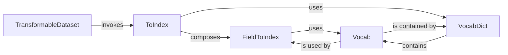

## Details

The `Data & Preprocessing` subsystem in HanLP is responsible for the entire lifecycle of raw text data, from loading and initial transformation to numerical representation and batching for model consumption. Its boundaries encompass modules that handle data loading, transformation pipelines, vocabulary management, and data batching utilities.

### TransformableDataset
The primary orchestrator of the data pipeline. It handles loading raw data, applying a sequence of transformations, caching processed data, and preparing data into batches (tensorization and padding) suitable for model input. It also manages data splitting and sampling strategies.

**Related Classes/Methods**:

- <a href="https://github.com/hankcs/HanLP/blob/master/hanlp/common/dataset.py#L109-L311" target="_blank" rel="noopener noreferrer">`TransformableDataset`:109-311</a>

### ToIndex
A composite transformation that converts various data fields (e.g., words, characters, labels) into numerical indices. It can chain multiple `FieldToIndex` transformations and manages the loading/saving of associated vocabularies.

**Related Classes/Methods**:

- <a href="https://github.com/hankcs/HanLP/blob/master/hanlp/common/transform.py#L19-L40" target="_blank" rel="noopener noreferrer">`ToIndex`:19-40</a>

### FieldToIndex
A granular transformation responsible for converting a specific field within a data sample into its numerical index using a dedicated vocabulary. It's a fundamental building block for more complex transformations like `ToIndex`.

**Related Classes/Methods**:

- <a href="https://github.com/hankcs/HanLP/blob/master/hanlp/common/transform.py#L43-L64" target="_blank" rel="noopener noreferrer">`FieldToIndex`:43-64</a>

### VocabDict
Manages a collection of `Vocab` objects, typically keyed by field names or transformation types. It provides a centralized lookup and management system for different vocabularies used across various transformations.

**Related Classes/Methods**:

- <a href="https://github.com/hankcs/HanLP/blob/master/hanlp/common/transform.py#L99-L227" target="_blank" rel="noopener noreferrer">`VocabDict`:99-227</a>

### Vocab
The fundamental component for creating and managing the mapping between textual tokens (words, characters, labels) and their unique numerical identifiers. It handles adding new tokens, retrieving indices, and managing special tokens (UNK, PAD). It also supports locking to prevent new token additions after training.

**Related Classes/Methods**:

- <a href="https://github.com/hankcs/HanLP/blob/master/hanlp/common/keras_component.py" target="_blank" rel="noopener noreferrer">`Vocab`</a>

### [FAQ](https://github.com/CodeBoarding/GeneratedOnBoardings/tree/main?tab=readme-ov-file#faq)