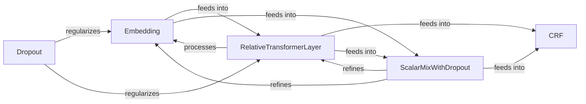

## Details

This subsystem focuses on advanced sequence modeling, primarily for natural language processing tasks. It begins with the `Embedding` component, which transforms raw linguistic units into dense vector representations. These embeddings are then processed by the `RelativeTransformerLayer`, a core component for capturing contextual information and long-range dependencies within sequences. For enhanced feature representation and regularization, the `ScalarMixWithDropout` component intelligently combines and refines outputs from various layers, including embeddings and transformer outputs. `Dropout` is also independently applied for general regularization. Finally, for sequence labeling tasks, the `CRF` component acts as the output layer, modeling tag dependencies to produce coherent and accurate predictions. This architecture emphasizes robust feature extraction, contextual understanding, and structured prediction for sequence-based problems.

### Embedding
Provides various methods to convert discrete linguistic units (words, characters, strings) into dense, continuous vector representations (embeddings) that capture semantic and syntactic information. This component serves as the base for specific embedding types like `CharCNN`, `CharRNN`, `ContextualStringEmbedding`, `FastTextEmbeddingModule`, and `Word2VecEmbeddingModule`.

**Related Classes/Methods**: _None_

### RelativeTransformerLayer
Implements a core building block of Transformer models, incorporating relative positional encodings to capture positional information without absolute positions, crucial for advanced sequence modeling.

**Related Classes/Methods**: _None_

### CRF
Implements the Conditional Random Field algorithm, primarily used as a sequence labeling layer to model dependencies between output tags in tasks like Named Entity Recognition or Part-of-Speech Tagging. It typically acts as the final output layer for sequence prediction.

**Related Classes/Methods**: _None_

### ScalarMixWithDropout
Combines multiple feature representations (e.g., from different layers or different embedding types) into a single, richer representation using learnable scalar weights. It also incorporates dropout for regularization.

**Related Classes/Methods**: _None_

### Dropout
A common regularization technique used to prevent overfitting by randomly setting a fraction of input units to zero during training. It can be applied at various points within the network.

**Related Classes/Methods**: _None_

### [FAQ](https://github.com/CodeBoarding/GeneratedOnBoardings/tree/main?tab=readme-ov-file#faq)