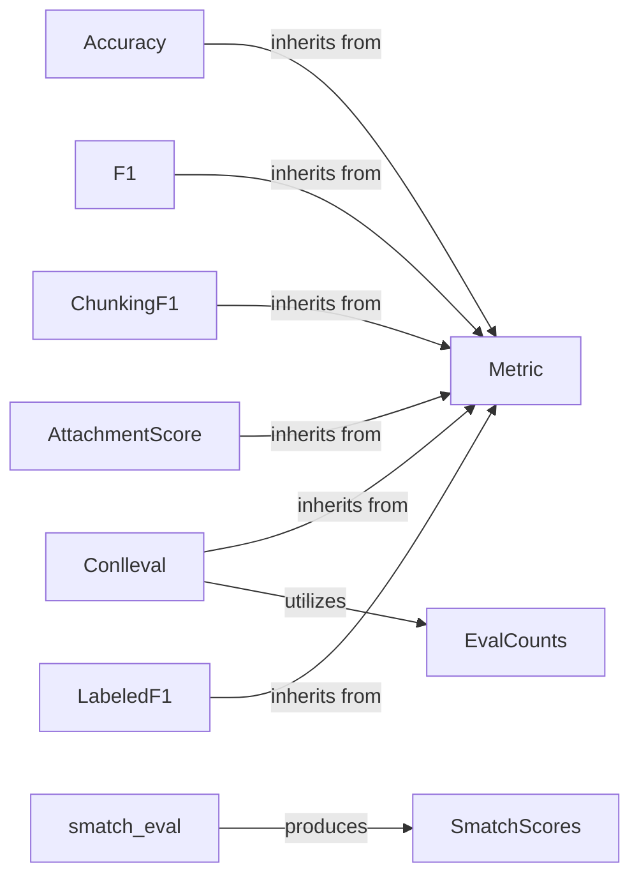

## Details

The `hanlp.metrics` subsystem is designed around a flexible and extensible framework for evaluating various Natural Language Processing (NLP) tasks. Its architecture is centered on a foundational abstract class, `Metric`, which defines the essential contract for all evaluation metrics, ensuring uniformity in performance reporting and state management.

Concrete metric implementations, such as `Accuracy`, `F1`, `ChunkingF1`, `Conlleval`, `AttachmentScore`, and `LabeledF1`, extend this `Metric` base, each providing specialized evaluation capabilities for distinct NLP tasks like classification, sequence labeling, and dependency parsing. For instance, `Conlleval` leverages an internal helper, `EvalCounts`, to meticulously track true positives, false positives, and false negatives, which are crucial for its detailed F1 score computations. Similarly, for complex evaluations like Abstract Meaning Representation (AMR) parsing, the subsystem provides the `SmatchScores` component, a dedicated data structure designed to encapsulate the comprehensive results generated by the `smatch_eval` function. This modular design facilitates the integration of new metrics while maintaining consistency across the evaluation landscape of HanLP.

### Metric
This is the abstract base class that serves as the foundational contract for all evaluation metrics within HanLP. It defines the common interface for performance reporting and state management, ensuring consistency across different metric implementations.

**Related Classes/Methods**:

- <a href="https://github.com/hankcs/HanLP/blob/master/hanlp/metrics/metric.py#L7-L44" target="_blank" rel="noopener noreferrer">`hanlp.metrics.metric.Metric`:7-44</a>

### Accuracy
A concrete implementation of Metric specifically designed for calculating classification accuracy.

**Related Classes/Methods**:

- <a href="https://github.com/hankcs/HanLP/blob/master/hanlp/metrics/accuracy.py" target="_blank" rel="noopener noreferrer">`hanlp.metrics.accuracy.Accuracy`</a>

### F1
A concrete implementation of Metric for computing precision, recall, and F1-score, commonly used in classification and sequence labeling tasks.

**Related Classes/Methods**:

- <a href="https://github.com/hankcs/HanLP/blob/master/hanlp/metrics/f1.py#L9-L42" target="_blank" rel="noopener noreferrer">`hanlp.metrics.f1.F1`:9-42</a>

### ChunkingF1
A specialized metric for evaluating the performance of models on chunking tasks, often used in named entity recognition or shallow parsing.

**Related Classes/Methods**:

- <a href="https://github.com/hankcs/HanLP/blob/master/hanlp/metrics/chunking/chunking_f1.py" target="_blank" rel="noopener noreferrer">`hanlp.metrics.chunking.ChunkingF1`</a>

### Conlleval
Implements the standard CoNLL evaluation for sequence labeling tasks, providing detailed precision, recall, and F1 scores for different entity types. It internally utilizes `EvalCounts` for managing evaluation statistics.

**Related Classes/Methods**:

- <a href="https://github.com/hankcs/HanLP/blob/master/hanlp/metrics/chunking/conlleval.py" target="_blank" rel="noopener noreferrer">`hanlp.metrics.chunking.Conlleval`</a>

### AttachmentScore
A metric for dependency parsing, measuring Unlabeled Attachment Score (UAS) and Labeled Attachment Score (LAS) to assess the accuracy of predicted syntactic dependencies.

**Related Classes/Methods**:

- <a href="https://github.com/hankcs/HanLP/blob/master/hanlp/metrics/parsing/attachmentscore.py#L26-L75" target="_blank" rel="noopener noreferrer">`hanlp.metrics.parsing.attachmentscore.AttachmentScore`:26-75</a>

### LabeledF1
Calculates labeled and unlabeled F1 scores for parsing tasks, providing a comprehensive evaluation of parsing accuracy.

**Related Classes/Methods**:

- <a href="https://github.com/hankcs/HanLP/blob/master/hanlp/metrics/parsing/labeled_f1.py" target="_blank" rel="noopener noreferrer">`hanlp.metrics.parsing.LabeledF1`</a>

### SmatchScores
A helper component designed to store and retrieve Abstract Meaning Representation (AMR) evaluation scores, typically populated by the `smatch_eval` function.

**Related Classes/Methods**:

- <a href="https://github.com/hankcs/HanLP/blob/master/hanlp/metrics/amr/smatch_eval.py#L17-L20" target="_blank" rel="noopener noreferrer">`hanlp.metrics.amr.smatch_eval.SmatchScores`:17-20</a>

### EvalCounts
An internal helper utilized by `Conlleval` for managing evaluation statistics.

**Related Classes/Methods**: _None_

### smatch_eval
A function that typically populates `SmatchScores` with Abstract Meaning Representation (AMR) evaluation scores.

**Related Classes/Methods**: _None_

### [FAQ](https://github.com/CodeBoarding/GeneratedOnBoardings/tree/main?tab=readme-ov-file#faq)