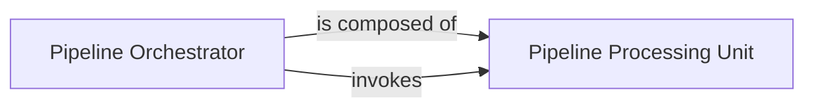

## Details

The core of the NLP subsystem revolves around the `Pipeline Orchestrator`, which serves as the central control for defining and executing NLP workflows. It constructs pipelines by composing various `Pipeline Processing Unit` instances, each representing a distinct NLP task. During execution, the `Pipeline Orchestrator` sequentially invokes these processing units, ensuring a structured flow of data through the defined NLP stages. This design promotes modularity and reusability, allowing for flexible construction of complex NLP pipelines from standardized, interchangeable components.

### Pipeline Orchestrator
This component acts as the central orchestrator for NLP workflows. It is responsible for constructing, managing, and executing a sequence of individual NLP processing units. It provides methods for adding components, saving/loading pipeline configurations, and initiating the overall processing flow. Its importance lies in defining the high-level structure and execution order of NLP tasks, aligning with the "Pipeline" architectural pattern.

**Related Classes/Methods**:

- <a href="https://github.com/hankcs/HanLP/blob/master/hanlp/components/pipeline.py#L78-L179" target="_blank" rel="noopener noreferrer">`hanlp.components.pipeline.Pipeline`:78-179</a>

### Pipeline Processing Unit
This abstract base class defines the standard interface for any individual NLP processing unit that can be integrated into a `Pipeline`. It ensures that all components adhere to a common contract for input processing and output generation, facilitating modularity and extensibility. It is fundamental for enabling the "Modular Design" and "Pipeline" patterns by standardizing how different NLP functionalities interact within the system.

**Related Classes/Methods**:

- <a href="https://github.com/hankcs/HanLP/blob/master/hanlp/components/pipeline.py#L15-L75" target="_blank" rel="noopener noreferrer">`hanlp.components.pipeline.Pipe`:15-75</a>

### [FAQ](https://github.com/CodeBoarding/GeneratedOnBoardings/tree/main?tab=readme-ov-file#faq)