```mermaid
graph LR
    API_Gateway["API Gateway"]
    NLP_Pipeline_Orchestration["NLP Pipeline Orchestration"]
    Base_Component_Framework["Base Component Framework"]
    Data_Preprocessing["Data & Preprocessing"]
    Core_NLP_Modules["Core NLP Modules"]
    Deep_Learning_Layers["Deep Learning Layers"]
    Evaluation_Metrics["Evaluation & Metrics"]
    API_Gateway -- "dispatches requests" --> NLP_Pipeline_Orchestration
    NLP_Pipeline_Orchestration -- "returns results" --> API_Gateway
    NLP_Pipeline_Orchestration -- "manages execution" --> Base_Component_Framework
    Base_Component_Framework -- "requests data" --> Data_Preprocessing
    Data_Preprocessing -- "supplies processed data" --> Base_Component_Framework
    Data_Preprocessing -- "supplies processed input" --> Core_NLP_Modules
    Core_NLP_Modules -- "produces output" --> Base_Component_Framework
    Core_NLP_Modules -- "utilizes for models" --> Deep_Learning_Layers
    Base_Component_Framework -- "constructs models using" --> Deep_Learning_Layers
    Base_Component_Framework -- "sends data for evaluation" --> Evaluation_Metrics
    Evaluation_Metrics -- "reports performance" --> Base_Component_Framework
    click API_Gateway href "https://github.com/CodeBoarding/GeneratedOnBoardings/blob/main/HanLP/API_Gateway.md" "Details"
    click NLP_Pipeline_Orchestration href "https://github.com/CodeBoarding/GeneratedOnBoardings/blob/main/HanLP/NLP_Pipeline_Orchestration.md" "Details"
    click Base_Component_Framework href "https://github.com/CodeBoarding/GeneratedOnBoardings/blob/main/HanLP/Base_Component_Framework.md" "Details"
    click Data_Preprocessing href "https://github.com/CodeBoarding/GeneratedOnBoardings/blob/main/HanLP/Data_Preprocessing.md" "Details"
    click Deep_Learning_Layers href "https://github.com/CodeBoarding/GeneratedOnBoardings/blob/main/HanLP/Deep_Learning_Layers.md" "Details"
    click Evaluation_Metrics href "https://github.com/CodeBoarding/GeneratedOnBoardings/blob/main/HanLP/Evaluation_Metrics.md" "Details"
```

## Details

The HanLP system is structured around a modular architecture, facilitating flexible and extensible NLP processing. The `API Gateway` serves as the primary external interface, handling incoming requests and dispatching them to the `NLP Pipeline Orchestration`. This orchestration component is central to managing the execution flow of various NLP tasks, leveraging the `Base Component Framework` to interact with individual NLP modules. The `Base Component Framework` provides a standardized interface for all pluggable NLP components, ensuring consistency in their lifecycle and operations.

Data handling is managed by the `Data & Preprocessing` component, which prepares raw text for consumption by the NLP models and supplies it to both the `Base Component Framework` and directly to `Core NLP Modules`. The `Core NLP Modules` represent the specialized linguistic processing capabilities, performing tasks like tokenization and parsing, and producing output that is then handled by the `Base Component Framework`. These modules heavily rely on the `Deep Learning Layers` for constructing their underlying models. Finally, the `Evaluation & Metrics` component is integrated with the `Base Component Framework` to assess model performance, providing crucial feedback for system refinement. This design promotes clear separation of concerns, enabling efficient development, deployment, and scaling of NLP functionalities.

### API Gateway [[Expand]](./API_Gateway.md)
The external interface for HanLP, allowing applications to access NLP functionalities via RESTful API calls. It acts as the entry point for client requests.

**Related Classes/Methods**:

- <a href="https://github.com/hankcs/HanLP/blob/master/plugins/hanlp_restful/hanlp_restful/__init__.py" target="_blank" rel="noopener noreferrer">`plugins/hanlp_restful/hanlp_restful/__init__.py`</a>

### NLP Pipeline Orchestration [[Expand]](./NLP_Pipeline_Orchestration.md)
Manages the sequence and execution of various NLP components, defining the overall processing flow for a given task. It enables flexible construction and execution of complex NLP workflows.

**Related Classes/Methods**:

- <a href="https://github.com/hankcs/HanLP/blob/master/hanlp/components/pipeline.py#L78-L179" target="_blank" rel="noopener noreferrer">`hanlp.components.pipeline.Pipeline`:78-179</a>
- <a href="https://github.com/hankcs/HanLP/blob/master/hanlp/components/pipeline.py#L15-L75" target="_blank" rel="noopener noreferrer">`hanlp.components.pipeline.Pipe`:15-75</a>

### Base Component Framework [[Expand]](./Base_Component_Framework.md)
Provides the foundational abstract framework for all individual NLP components, handling their lifecycle from initialization to prediction, training, and persistence. It ensures a consistent interface for all pluggable NLP modules.

**Related Classes/Methods**:

- <a href="https://github.com/hankcs/HanLP/blob/master/hanlp/common/component.py#L11-L36" target="_blank" rel="noopener noreferrer">`hanlp.common.component.Component`:11-36</a>
- <a href="https://github.com/hankcs/HanLP/blob/master/hanlp/common/torch_component.py" target="_blank" rel="noopener noreferrer">`hanlp.common.torch_component.py`</a>
- <a href="https://github.com/hankcs/HanLP/blob/master/hanlp/common/keras_component.py" target="_blank" rel="noopener noreferrer">`hanlp.common.keras_component.py`</a>

### Data & Preprocessing [[Expand]](./Data_Preprocessing.md)
Responsible for loading, preprocessing, and batching raw text data into a format suitable for model consumption. It also manages the mapping between textual tokens and their numerical representations (vocabularies).

**Related Classes/Methods**:

- <a href="https://github.com/hankcs/HanLP/blob/master/hanlp/common/dataset.py#L109-L311" target="_blank" rel="noopener noreferrer">`hanlp.common.dataset.TransformableDataset`:109-311</a>
- <a href="https://github.com/hankcs/HanLP/blob/master/hanlp/common/transform.py#L19-L40" target="_blank" rel="noopener noreferrer">`hanlp.common.transform.ToIndex`:19-40</a>
- <a href="https://github.com/hankcs/HanLP/blob/master/hanlp/common/transform.py#L43-L64" target="_blank" rel="noopener noreferrer">`hanlp.common.transform.FieldToIndex`:43-64</a>
- <a href="https://github.com/hankcs/HanLP/blob/master/hanlp/common/transform.py#L99-L227" target="_blank" rel="noopener noreferrer">`hanlp.common.transform.VocabDict`:99-227</a>
- <a href="https://github.com/hankcs/HanLP/blob/master/hanlp/common/vocab.py#L12-L376" target="_blank" rel="noopener noreferrer">`hanlp.common.vocab.Vocab`:12-376</a>

### Core NLP Modules
A comprehensive collection of specialized modules that perform specific NLP tasks (e.g., tokenization, tagging, parsing, classification). This is the heart of HanLP's linguistic processing capabilities.

**Related Classes/Methods**:

- <a href="https://github.com/hankcs/HanLP/blob/master/hanlp/components/tokenizers/__init__.py" target="_blank" rel="noopener noreferrer">`hanlp/components/tokenizers/__init__.py`</a>
- <a href="https://github.com/hankcs/HanLP/blob/master/hanlp/components/taggers/__init__.py" target="_blank" rel="noopener noreferrer">`hanlp/components/taggers/__init__.py`</a>
- <a href="https://github.com/hankcs/HanLP/blob/master/hanlp/components/ner/__init__.py" target="_blank" rel="noopener noreferrer">`hanlp/components/ner/__init__.py`</a>
- <a href="https://github.com/hankcs/HanLP/blob/master/hanlp/components/parsers/__init__.py" target="_blank" rel="noopener noreferrer">`hanlp/components/parsers/__init__.py`</a>
- <a href="https://github.com/hankcs/HanLP/blob/master/hanlp/components/amr/__init__.py" target="_blank" rel="noopener noreferrer">`hanlp/components/amr/__init__.py`</a>
- <a href="https://github.com/hankcs/HanLP/blob/master/hanlp/components/classifiers/__init__.py" target="_blank" rel="noopener noreferrer">`hanlp/components/classifiers/__init__.py`</a>
- <a href="https://github.com/hankcs/HanLP/blob/master/hanlp/components/sts/__init__.py" target="_blank" rel="noopener noreferrer">`hanlp/components/sts/__init__.py`</a>
- <a href="https://github.com/hankcs/HanLP/blob/master/hanlp/components/mtl/__init__.py" target="_blank" rel="noopener noreferrer">`hanlp/components/mtl/__init__.py`</a>

### Deep Learning Layers [[Expand]](./Deep_Learning_Layers.md)
Provides fundamental building blocks for constructing deep learning models, including various neural network layers (e.g., RNNs, Transformers, CRFs) and different types of embeddings (word, character, contextual).

**Related Classes/Methods**:

- <a href="https://github.com/hankcs/HanLP/blob/master/hanlp/layers/__init__.py" target="_blank" rel="noopener noreferrer">`hanlp/layers/__init__.py`</a>

### Evaluation & Metrics [[Expand]](./Evaluation_Metrics.md)
Contains a comprehensive set of evaluation metrics used to assess the performance of NLP models across various tasks, providing insights into model performance.

**Related Classes/Methods**:

- <a href="https://github.com/hankcs/HanLP/blob/master/hanlp/metrics/__init__.py" target="_blank" rel="noopener noreferrer">`hanlp/metrics/__init__.py`</a>

### [FAQ](https://github.com/CodeBoarding/GeneratedOnBoardings/tree/main?tab=readme-ov-file#faq)