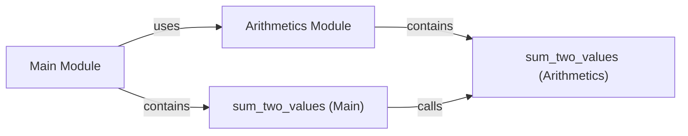

## Component Details

### Arithmetics Module
This module contains arithmetic functions such as addition. It provides basic mathematical operations for use by other modules within the core package.
- **Related Classes/Methods**: `mypackage.arithmetics`

### sum_two_values (Arithmetics)
This function performs the addition of two numbers. It takes two numerical arguments and returns their sum. It is a core function within the arithmetics module, providing a basic mathematical operation.
- **Related Classes/Methods**: `mypackage.arithmetics`

### Main Module
The main module serves as the entry point for the application. It orchestrates the execution of the program by utilizing functions from other modules, such as the arithmetics module, to perform specific tasks.
- **Related Classes/Methods**: `mypackage.main`

### sum_two_values (Main)
This function calls the add function from the arithmetics module. It acts as an intermediary, delegating the actual addition operation to the arithmetics module. This promotes modularity and separation of concerns.
- **Related Classes/Methods**: `mypackage.main`
