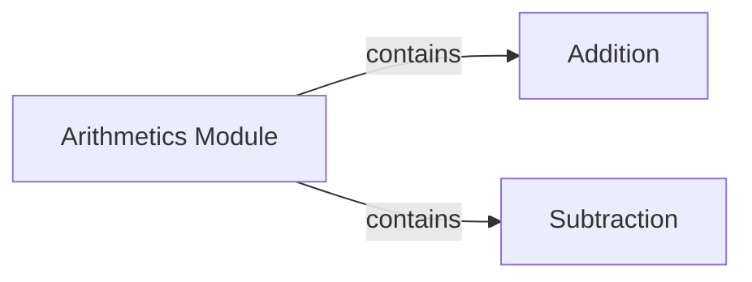

## Component Details

The Arithmetics Module provides basic arithmetic operations, currently focusing on addition and subtraction. It serves as a simple calculator, taking numerical inputs and returning the result of the chosen operation. The module is designed to be extensible, allowing for the addition of more complex arithmetic functions in the future.

### Arithmetics Module
The arithmetics module serves as a container for arithmetic operations. It currently houses the addition and subtraction functions.
- **Related Classes/Methods**: `mypackage.arithmetics`

### Addition
The addition component is responsible for summing two numerical values. It takes two numerical inputs and returns their sum.
- **Related Classes/Methods**: `mypackage.arithmetics.addition`

### Subtraction
The subtraction component is responsible for subtracting two numerical values. It takes two numerical inputs and returns their difference.
- **Related Classes/Methods**: `mypackage.arithmetics.subtraction`
