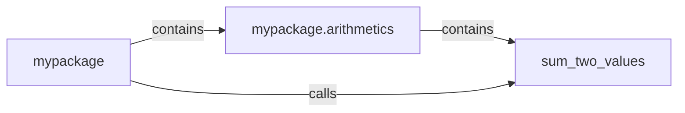

## Component Details

### mypackage
The root package of the project. It serves as the entry point and orchestrates the interaction between different modules. It initializes and calls the necessary functions to perform the application's core logic, which currently involves summing two values using the arithmetics module.
- **Related Classes/Methods**: `mypackage`

### mypackage.arithmetics
This module contains arithmetic functions. Currently, it includes the sum_two_values function. It is responsible for performing basic arithmetic operations as requested by the main package.
- **Related Classes/Methods**: `mypackage.arithmetics`

### sum_two_values
This function calculates the sum of two input values. It takes two numerical arguments and returns their sum. It is a simple arithmetic operation encapsulated within the arithmetics module.
- **Related Classes/Methods**: `mypackage.arithmetics`
