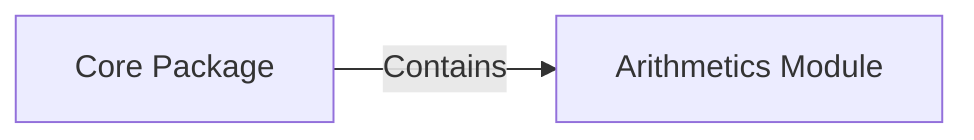

## Component Details

### Core Package
The core package serves as the main container for all modules and provides the entry point for execution. It orchestrates the interaction between different modules to perform the overall application logic.
- **Related Classes/Methods**: `mypackage`

### Arithmetics Module
This module contains arithmetic functions such as addition. It provides basic mathematical operations for use by other modules within the core package.
- **Related Classes/Methods**: `mypackage.arithmetics`