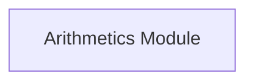

## Component Details

The Hello-Python project is a simple application that demonstrates basic arithmetic operations. The main flow involves performing a summation of two numbers using the Arithmetics Module. The purpose is to showcase a basic Python project structure and functionality.

### Arithmetics Module
This module encapsulates the arithmetic operations. Currently, it only provides the functionality to sum two numbers. Its main responsibility is to perform basic calculations.
- **Related Classes/Methods**: `mypackage.arithmetics`