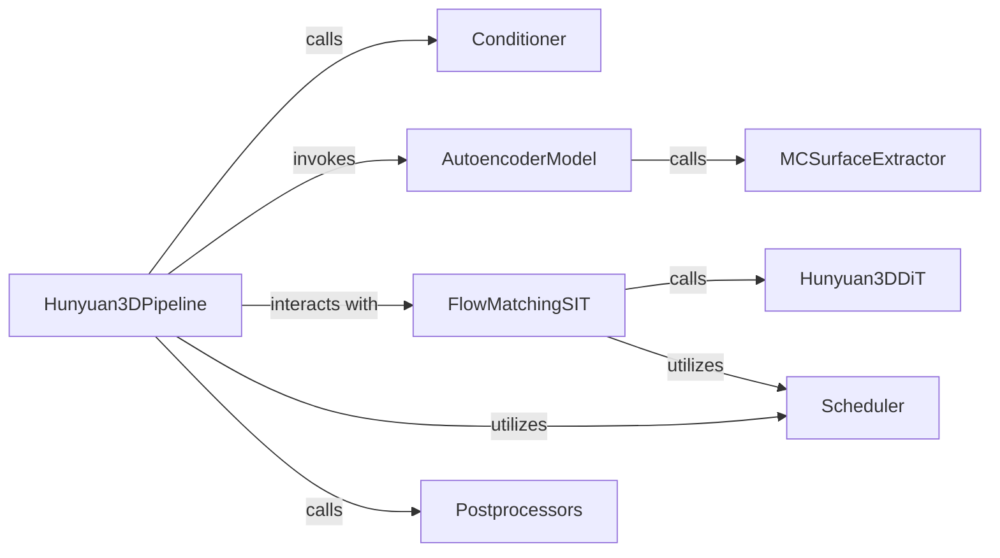

## Details

The Hunyuan3D project is structured around a central Hunyuan3DPipeline that orchestrates the 3D shape generation process. This pipeline begins by utilizing a Conditioner to process input conditions, which then guide the generative process. The core of the generation involves the FlowMatchingSIT component, which leverages the Hunyuan3DDiT (a Diffusion Transformer) to iteratively refine a latent representation of the 3D shape. The Scheduler component plays a crucial role in managing the timesteps and noise schedules for the diffusion process, ensuring stable and high-quality generation. An AutoencoderModel (specifically ShapeVAE) is responsible for encoding raw 3D data into a compact latent space for the diffusion model and decoding these latents back into a volumetric representation. Finally, the MCSurfaceExtractor materializes the 3D shape by extracting a mesh surface from the decoded volume, and Postprocessors refine the generated mesh for final output. This architecture highlights a clear flow from input conditioning and latent space manipulation to iterative refinement and final mesh generation.

### Hunyuan3DPipeline
Orchestrates the end-to-end 3D shape generation process, managing the flow from input conditioning to final mesh export. It acts as the central coordinator for the entire pipeline.

**Related Classes/Methods**:

- <a href="https://github.com/Tencent-Hunyuan/Hunyuan3D-2.1/blob/main/hy3dshape/hy3dshape/pipelines.py" target="_blank" rel="noopener noreferrer">`hy3dshape.hy3dshape.pipelines.Hunyuan3DPipeline`</a>

### AutoencoderModel
Compresses 3D data into a compact latent representation (encoding) and reconstructs 3D shapes from these latents (decoding), bridging raw data and the diffusion model's latent space. It's crucial for efficient latent space manipulation.

**Related Classes/Methods**:

- <a href="https://github.com/Tencent-Hunyuan/Hunyuan3D-2.1/blob/main/hy3dshape/hy3dshape/models/autoencoders/model.py#L238-L339" target="_blank" rel="noopener noreferrer">`hy3dshape.hy3dshape.models.autoencoders.model.ShapeVAE`:238-339</a>

### FlowMatchingSIT
Implements the specific diffusion or flow matching algorithm, managing the forward (noise addition) and reverse (denoising) steps to transform noise into a meaningful latent representation. This is the core diffusion mechanism.

**Related Classes/Methods**:

- <a href="https://github.com/Tencent-Hunyuan/Hunyuan3D-2.1/blob/main/hy3dshape/hy3dshape/models/diffusion/flow_matching_sit.py" target="_blank" rel="noopener noreferrer">`hy3dshape.hy3dshape.models.diffusion.flow_matching_sit.FlowMatchingSIT`</a>

### Hunyuan3DDiT
The core generative model (denoiser) within the diffusion framework. It predicts noise or velocity in the latent space, iteratively refining a noisy latent representation into a clean 3D shape latent. This component performs the actual generative step.

**Related Classes/Methods**:

- <a href="https://github.com/Tencent-Hunyuan/Hunyuan3D-2.1/blob/main/hy3dshape/hy3dshape/models/denoisers/hunyuan3ddit.py#L284-L404" target="_blank" rel="noopener noreferrer">`hy3dshape.hy3dshape.models.denoisers.hunyuan3ddit.Hunyuan3DDiT`:284-404</a>

### Conditioner
Processes and encodes various input conditions (e.g., images, text) into a format consumable by the denoiser model (Hunyuan3DDiT) to guide 3D shape generation. It ensures the generated shapes align with user input.

**Related Classes/Methods**:

- <a href="https://github.com/Tencent-Hunyuan/Hunyuan3D-2.1/blob/main/hy3dshape/hy3dshape/models/conditioner.py" target="_blank" rel="noopener noreferrer">`hy3dshape.hy3dshape.models.conditioner.Conditioner`</a>

### Scheduler
Manages timesteps and noise schedules throughout the diffusion process, influencing the quality and stability of generation. It's vital for controlling the iterative refinement.

**Related Classes/Methods**:

- <a href="https://github.com/Tencent-Hunyuan/Hunyuan3D-2.1/blob/main/hy3dshape/hy3dshape/schedulers.py#L56-L321" target="_blank" rel="noopener noreferrer">`hy3dshape.hy3dshape.schedulers.FlowMatchEulerDiscreteScheduler`:56-321</a>

### MCSurfaceExtractor
Extracts a coherent mesh surface from the decoded latent representation or volume, converting abstract data into a tangible 3D mesh. This component is responsible for materializing the 3D shape.

**Related Classes/Methods**:

- <a href="https://github.com/Tencent-Hunyuan/Hunyuan3D-2.1/blob/main/hy3dshape/hy3dshape/models/autoencoders/surface_extractors.py#L101-L124" target="_blank" rel="noopener noreferrer">`hy3dshape.hy3dshape.models.autoencoders.surface_extractors.MCSurfaceExtractor`:101-124</a>

### Postprocessors
Performs post-processing operations on generated 3D meshes to improve quality and prepare them for downstream use (e.g., normalization, face reduction, smoothing). This ensures the final output is production-ready.

**Related Classes/Methods**:

- <a href="https://github.com/Tencent-Hunyuan/Hunyuan3D-2.1/blob/main/hy3dshape/hy3dshape/postprocessors.py" target="_blank" rel="noopener noreferrer">`hy3dshape.hy3dshape.postprocessors`</a>

### [FAQ](https://github.com/CodeBoarding/GeneratedOnBoardings/tree/main?tab=readme-ov-file#faq)