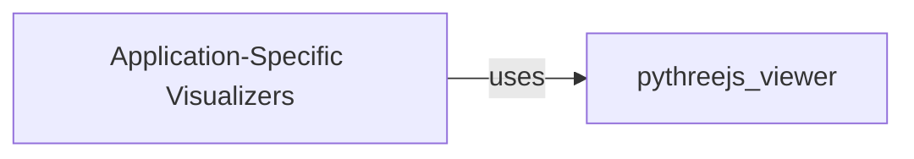

## Details

Updated analysis insights with corrected FileRef for pythreejs_viewer.py components.

### pythreejs_viewer
A class for visualizing 3D shapes using pythreejs.

**Related Classes/Methods**:

### Application-Specific Visualizers
Application-Specific Visualizers

**Related Classes/Methods**:

### [FAQ](https://github.com/CodeBoarding/GeneratedOnBoardings/tree/main?tab=readme-ov-file#faq)