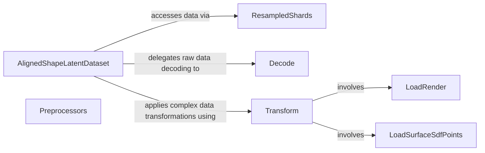

## Details

The `hy3dshape` data processing subsystem is centered around the `AlignedShapeLatentDataset`, which acts as the primary data pipeline orchestrator. It efficiently manages the loading and preparation of 3D shape and latent data by interacting with `ResampledShards` for optimized data access. Raw data is initially processed by the `Decode` component, which handles the conversion of NPZ files into usable formats. Subsequently, the `Transform` component applies a series of specialized transformations, leveraging `LoadRender` for visual data preparation and `LoadSurfaceSdfPoints` for geometric data processing. The `Preprocessors` component provides initial image conditioning before data enters the main pipeline, ensuring all inputs are correctly formatted for downstream tasks. This structured flow ensures robust and efficient handling of complex 3D datasets for machine learning applications.

### AlignedShapeLatentDataset
Acts as the central orchestrator for loading, decoding, and transforming 3D shape and latent data. It manages the entire data lifecycle, from configuration loading to providing iterable data loaders for training and validation. It is the primary interface for accessing prepared 3D data.

**Related Classes/Methods**:

- <a href="https://github.com/Tencent-Hunyuan/Hunyuan3D-2.1/blob/main/hy3dshape/hy3dshape/data/dit_asl.py#L133-L290" target="_blank" rel="noopener noreferrer">`AlignedShapeLatentDataset`:133-290</a>

### Preprocessors
Handles the initial loading and fundamental transformations of image data (e.g., recentering, conversion to tensor). It prepares visual inputs for subsequent processing stages.

**Related Classes/Methods**:

- <a href="https://github.com/Tencent-Hunyuan/Hunyuan3D-2.1/blob/main/hy3dshape/hy3dshape/preprocessors.py#L1-L10" target="_blank" rel="noopener noreferrer">`Preprocessors`:1-10</a>

### ResampledShards
Manages efficient data sharding and resampling for large datasets, ensuring optimal data access for `AlignedShapeLatentDataset`. This component is vital for handling large-scale 3D datasets common in ML applications.

**Related Classes/Methods**:

- <a href="https://github.com/Tencent-Hunyuan/Hunyuan3D-2.1/blob/main/hy3dshape/hy3dshape/data/dit_asl.py#L40-L60" target="_blank" rel="noopener noreferrer">`ResampledShards`:40-60</a>

### Decode
Decodes raw data, specifically reading NPZ files containing 3D representations. This is a critical step in converting raw stored data into usable formats for the pipeline.

**Related Classes/Methods**:

- <a href="https://github.com/Tencent-Hunyuan/Hunyuan3D-2.1/blob/main/hy3dshape/hy3dshape/data/dit_asl.py#L247-L259" target="_blank" rel="noopener noreferrer">`Decode`:247-259</a>

### Transform
Applies a sequence of specialized transformations to raw 3D data, including orchestrating the loading of render data and surface SDF points. This component ensures data is in the correct format and representation for model consumption.

**Related Classes/Methods**:

- <a href="https://github.com/Tencent-Hunyuan/Hunyuan3D-2.1/blob/main/hy3dshape/hy3dshape/data/dit_asl.py" target="_blank" rel="noopener noreferrer">`Transform`</a>

### LoadRender
Handles the loading and preparation (e.g., padding) of rendering-specific data. This component is a specialized part of the transformation pipeline, focusing on visual aspects of 3D data.

**Related Classes/Methods**:

- <a href="https://github.com/Tencent-Hunyuan/Hunyuan3D-2.1/blob/main/hy3dshape/hy3dshape/data/dit_asl.py#L200-L245" target="_blank" rel="noopener noreferrer">`LoadRender`:200-245</a>

### LoadSurfaceSdfPoints
Loads surface SDF (Signed Distance Function) points. This component is another specialized part of the transformation pipeline, focusing on geometric representations of 3D data.

**Related Classes/Methods**:

- <a href="https://github.com/Tencent-Hunyuan/Hunyuan3D-2.1/blob/main/hy3dshape/hy3dshape/data/dit_asl.py#L149-L198" target="_blank" rel="noopener noreferrer">`LoadSurfaceSdfPoints`:149-198</a>

### [FAQ](https://github.com/CodeBoarding/GeneratedOnBoardings/tree/main?tab=readme-ov-file#faq)