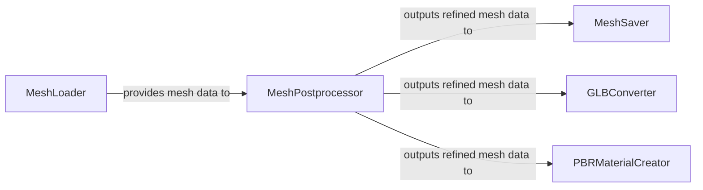

## Details

The hy3dshape subsystem focuses on the processing and management of 3D mesh data. The core workflow begins with the MeshLoader component, which is responsible for ingesting mesh data from various sources. Once loaded, the data is passed to the MeshPostprocessor, a central component that performs critical transformations such as simplification, cleaning, and optimization. This refined mesh data can then be persisted by the MeshSaver component, converted to the GLB format by the GLBConverter, or used by the PBRMaterialCreator to generate GLB files with advanced Physically Based Rendering materials. This architecture ensures a clear separation of concerns, allowing for modular development and efficient handling of 3D model pipelines.

### MeshLoader
Responsible for loading 3D mesh data from various file formats (e.g., OBJ) into the system's internal representation, making it available for subsequent processing.

**Related Classes/Methods**:

- <a href="https://github.com/Tencent-Hunyuan/Hunyuan3D-2.1/blob/main/hy3dpaint/DifferentiableRenderer/mesh_utils.py#L41-L58" target="_blank" rel="noopener noreferrer">`hy3dpaint.DifferentiableRenderer.mesh_utils.load_mesh`:41-58</a>

### MeshPostprocessor
Performs general post-processing operations on meshes, including simplification, cleaning, and other optimizations to prepare them for texturing and final output. This is the core transformation component.

**Related Classes/Methods**:

- <a href="https://github.com/Tencent-Hunyuan/Hunyuan3D-2.1/blob/main/hy3dshape/hy3dshape/postprocessors.py#L1-L201" target="_blank" rel="noopener noreferrer">`hy3dshape.hy3dshape.postprocessors`:1-201</a>

### MeshSaver
Persists 3D mesh data, primarily saving it into the OBJ format along with associated Material Template Library (MTL) files, allowing for storage or transfer.

**Related Classes/Methods**:

- <a href="https://github.com/Tencent-Hunyuan/Hunyuan3D-2.1/blob/main/hy3dpaint/DifferentiableRenderer/mesh_utils.py#L120-L149" target="_blank" rel="noopener noreferrer">`hy3dpaint.DifferentiableRenderer.mesh_utils.save_obj_mesh`:120-149</a>
- <a href="https://github.com/Tencent-Hunyuan/Hunyuan3D-2.1/blob/main/hy3dpaint/DifferentiableRenderer/mesh_utils.py#L193-L197" target="_blank" rel="noopener noreferrer">`hy3dpaint.DifferentiableRenderer.mesh_utils.save_mesh`:193-197</a>

### GLBConverter
Facilitates the conversion of 3D models from OBJ format to the GLB format, a common and efficient format for 3D model distribution and web-based rendering.

**Related Classes/Methods**:

- <a href="https://github.com/Tencent-Hunyuan/Hunyuan3D-2.1/blob/main/hy3dpaint/DifferentiableRenderer/mesh_utils.py#L260-L284" target="_blank" rel="noopener noreferrer">`hy3dpaint.DifferentiableRenderer.mesh_utils.convert_obj_to_glb`:260-284</a>

### PBRMaterialCreator
Orchestrates the creation of GLB files that incorporate Physically Based Rendering (PBR) materials, combining various texture and material properties for realistic rendering.

**Related Classes/Methods**:

- <a href="https://github.com/Tencent-Hunyuan/Hunyuan3D-2.1/blob/main/hy3dpaint/convert_utils.py#L42-L138" target="_blank" rel="noopener noreferrer">`hy3dpaint.convert_utils.create_glb_with_pbr_materials`:42-138</a>

### [FAQ](https://github.com/CodeBoarding/GeneratedOnBoardings/tree/main?tab=readme-ov-file#faq)