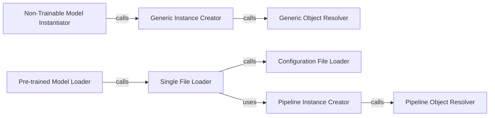

## Details

The Model & Configuration Management subsystem is primarily defined by the hy3dshape.hy3dshape.utils.misc module and key functions within hy3dshape.hy3dshape.pipelines. It encapsulates functionalities for loading, parsing, and instantiating ML models and their associated configurations, serving as a core infrastructure for the 3D asset generation system.

### Configuration File Loader
Responsible for reading and parsing configuration data from specified file paths, potentially handling recursive configuration loading. This is a foundational utility for managing model and pipeline settings.

**Related Classes/Methods**:

- <a href="https://github.com/Tencent-Hunyuan/Hunyuan3D-2.1/blob/main/hy3dshape/hy3dshape/utils/misc.py#L11-L27" target="_blank" rel="noopener noreferrer">`hy3dshape.hy3dshape.utils.misc.get_config_from_file`:11-27</a>

### Generic Object Resolver
A general-purpose utility for dynamically resolving and retrieving Python objects (classes, functions) given their fully qualified string names. It enables flexible, configuration-driven instantiation.

**Related Classes/Methods**:

- <a href="https://github.com/Tencent-Hunyuan/Hunyuan3D-2.1/blob/main/hy3dshape/hy3dshape/utils/misc.py#L30-L35" target="_blank" rel="noopener noreferrer">`hy3dshape.hy3dshape.utils.misc.get_obj_from_str`:30-35</a>

### Generic Instance Creator
The core general-purpose method for creating instances of objects based on a configuration dictionary. It uses get_obj_from_str to resolve the target object and then instantiates it with provided arguments.

**Related Classes/Methods**:

- <a href="https://github.com/Tencent-Hunyuan/Hunyuan3D-2.1/blob/main/hy3dshape/hy3dshape/utils/misc.py#L45-L63" target="_blank" rel="noopener noreferrer">`hy3dshape.hy3dshape.utils.misc.instantiate_from_config`:45-63</a>

### Non-Trainable Model Instantiator
A specialized instantiation method for models that are not intended for training. This suggests specific loading or optimization strategies for pre-trained or fixed components within the 3D asset generation process.

**Related Classes/Methods**:

- <a href="https://github.com/Tencent-Hunyuan/Hunyuan3D-2.1/blob/main/hy3dshape/hy3dshape/utils/misc.py#L72-L79" target="_blank" rel="noopener noreferrer">`hy3dshape.hy3dshape.utils.misc.instantiate_non_trainable_model`:72-79</a>

### Pipeline Object Resolver
A specialized object resolver within the pipelines module, ensuring consistent object resolution for pipeline-specific components. It mirrors the generic resolver but is scoped to pipeline contexts.

**Related Classes/Methods**:

- <a href="https://github.com/Tencent-Hunyuan/Hunyuan3D-2.1/blob/main/hy3dshape/hy3dshape/pipelines.py#L112-L117" target="_blank" rel="noopener noreferrer">`hy3dshape.hy3dshape.pipelines.get_obj_from_str`:112-117</a>

### Pipeline Instance Creator
The primary entry point within the pipelines module for instantiating models or components from configurations, tailored for pipeline-specific needs. It leverages pipelines.get_obj_from_str.

**Related Classes/Methods**:

- <a href="https://github.com/Tencent-Hunyuan/Hunyuan3D-2.1/blob/main/hy3dshape/hy3dshape/pipelines.py#L120-L127" target="_blank" rel="noopener noreferrer">`hy3dshape.hy3dshape.pipelines.instantiate_from_config`:120-127</a>

### Single File Loader
A higher-level function responsible for loading and instantiating a model or pipeline from a single configuration file. It abstracts the underlying configuration parsing and object instantiation, providing a simplified interface.

**Related Classes/Methods**:

- <a href="https://github.com/Tencent-Hunyuan/Hunyuan3D-2.1/blob/main/hy3dshape/hy3dshape/pipelines.py#L134-L193" target="_blank" rel="noopener noreferrer">`hy3dshape.hy3dshape.pipelines.from_single_file`:134-193</a>

### Pre-trained Model Loader
A convenience function for loading pre-trained models or pipelines. It simplifies the process by handling path resolution for pre-trained assets and delegates the actual loading to from_single_file, aligning with a "diffusers-like API" for ease of use.

**Related Classes/Methods**:

- <a href="https://github.com/Tencent-Hunyuan/Hunyuan3D-2.1/blob/main/hy3dshape/hy3dshape/pipelines.py#L195-L227" target="_blank" rel="noopener noreferrer">`hy3dshape.hy3dshape.pipelines.from_pretrained`:195-227</a>

### [FAQ](https://github.com/CodeBoarding/GeneratedOnBoardings/tree/main?tab=readme-ov-file#faq)