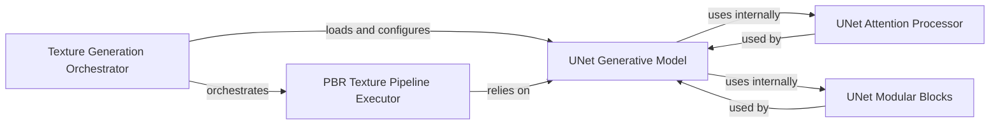

## Details

The Texture Synthesis Pipeline subsystem is responsible for generating and applying high-quality PBR textures to processed 3D shapes, ensuring realistic material properties. Its boundaries are primarily defined by the hy3dpaint.textureGenPipeline orchestrator and the core PBR texture generation logic within hy3dpaint.hunyuanpaintpbr.

### Texture Generation Orchestrator
This component serves as the high-level orchestrator for the entire texture generation process. It is responsible for initializing the pipeline's configuration, loading necessary pre-trained models (specifically the UNet model), and managing the overall flow of data through the texture synthesis stages. It acts as the primary entry point for initiating texture generation within the system.

**Related Classes/Methods**:

- <a href="https://github.com/Tencent-Hunyuan/Hunyuan3D-2.1/blob/main/hy3dpaint/textureGenPipeline.py" target="_blank" rel="noopener noreferrer">`hy3dpaint.textureGenPipeline`</a>

### PBR Texture Pipeline Executor
This component executes the core PBR texture generation steps. Its responsibilities include performing image transformations, encoding, denoising, and data type conversions, effectively implementing the main operational logic for synthesizing PBR textures. It encapsulates the sequence of operations required to produce the final textures.

**Related Classes/Methods**:

- <a href="https://github.com/Tencent-Hunyuan/Hunyuan3D-2.1/blob/main/hy3dpaint/hunyuanpaintpbr/pipeline.py" target="_blank" rel="noopener noreferrer">`hy3dpaint.hunyuanpaintpbr.pipeline`</a>

### UNet Generative Model
This is the central ML model within the texture synthesis pipeline, implementing a UNet-based generative architecture. It handles the core diffusion and generative steps, including prediction, training, and validation of texture features. This component is responsible for the actual creation of texture data.

**Related Classes/Methods**:

- <a href="https://github.com/Tencent-Hunyuan/Hunyuan3D-2.1/blob/main/hy3dpaint/hunyuanpaintpbr/unet/model.py" target="_blank" rel="noopener noreferrer">`hy3dpaint.hunyuanpaintpbr.unet.model`</a>

### UNet Attention Processor
This component manages the attention mechanisms within the `UNet Generative Model`. Its responsibilities include handling positional embeddings (e.g., 3D rotary position embeddings) and performing attention operations that are crucial for the model's ability to focus on relevant features during the texture generation process.

**Related Classes/Methods**:

- <a href="https://github.com/Tencent-Hunyuan/Hunyuan3D-2.1/blob/main/hy3dpaint/hunyuanpaintpbr/unet/attn_processor.py" target="_blank" rel="noopener noreferrer">`hy3dpaint.hunyuanpaintpbr.unet.attn_processor`</a>

### UNet Modular Blocks
This component provides modular building blocks for the `UNet Generative Model` architecture. These modules include fundamental components for handling conditional inputs, various attention blocks, and multi-resolution voxel calculations, forming the essential structural elements of the generative model.

**Related Classes/Methods**:

- <a href="https://github.com/Tencent-Hunyuan/Hunyuan3D-2.1/blob/main/hy3dpaint/hunyuanpaintpbr/unet/modules.py" target="_blank" rel="noopener noreferrer">`hy3dpaint.hunyuanpaintpbr.unet.modules`</a>

### [FAQ](https://github.com/CodeBoarding/GeneratedOnBoardings/tree/main?tab=readme-ov-file#faq)