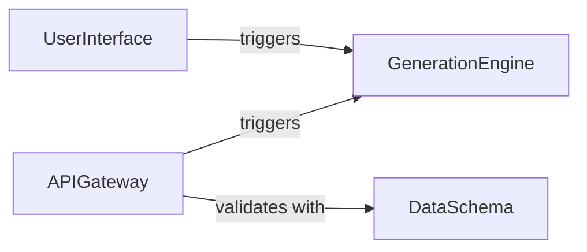

## Details

The 3D asset generation system is structured around a clear separation of concerns, providing both human and machine interfaces to its core functionality. The `UserInterface` component offers an interactive web-based experience for users to initiate 3D model generation. Concurrently, the `APIGateway` provides a programmatic RESTful interface, ensuring external systems can seamlessly integrate and trigger generation workflows, leveraging the `DataSchema` for consistent data exchange and validation. Both the `UserInterface` and `APIGateway` delegate the actual 3D asset creation to the `GenerationEngine`, which encapsulates the complex logic and resources required for model synthesis. This architecture ensures modularity, clear responsibilities, and distinct entry points for various types of consumers.

### UserInterface
This component provides the interactive web-based user interface using Gradio. It is responsible for capturing user inputs (parameters for 3D generation), orchestrating the display of generated 3D models, and managing the overall user experience. It acts as the primary human-facing entry point to the 3D asset generation system.

**Related Classes/Methods**:

- <a href="https://github.com/Tencent-Hunyuan/Hunyuan3D-2.1/blob/main/gradio_app.py" target="_blank" rel="noopener noreferrer">`gradio_app.UserInterface`</a>

### APIGateway
This component exposes a RESTful API, enabling external systems and automated workflows to programmatically interact with the 3D asset generation capabilities. It serves as the machine-facing entry point, handling incoming API requests and routing them to the appropriate backend services.

**Related Classes/Methods**:

- <a href="https://github.com/Tencent-Hunyuan/Hunyuan3D-2.1/blob/main/api_server.py" target="_blank" rel="noopener noreferrer">`api_server.APIGateway`</a>

### DataSchema
This component defines the data structures, schemas, and validation rules for the requests and responses exchanged via the REST API. It ensures data consistency, integrity, and proper formatting for all API interactions, acting as the contract between the API gateway and its consumers.

**Related Classes/Methods**:

- <a href="https://github.com/Tencent-Hunyuan/Hunyuan3D-2.1/blob/main/api_models.py" target="_blank" rel="noopener noreferrer">`api_models.DataSchema`</a>

### GenerationEngine
This component encapsulates the core logic for generating 3D assets. It receives generation requests from both the `UserInterface` and the `APIGateway`, processes them, and orchestrates the underlying 3D generation algorithms and resources to produce the final 3D models. This component addresses the need for a defined entity representing the "gradio_app.GenerationWorkflow" and "Core Generation Pipeline" mentioned in the feedback, serving as the central processing unit for 3D asset creation.

**Related Classes/Methods**: _None_

### [FAQ](https://github.com/CodeBoarding/GeneratedOnBoardings/tree/main?tab=readme-ov-file#faq)