```mermaid
graph LR
    User_Interface_API_Layer["User Interface & API Layer"]
    Input_Processing_Data_Loading["Input Processing & Data Loading"]
    3D_Shape_Generation_Pipeline["3D Shape Generation Pipeline"]
    Mesh_Post_processing_Conversion["Mesh Post-processing & Conversion"]
    Texture_Synthesis_Pipeline["Texture Synthesis Pipeline"]
    Differentiable_Rendering_Engine["Differentiable Rendering Engine"]
    3D_Visualization_Export["3D Visualization & Export"]
    Model_Configuration_Management["Model & Configuration Management"]
    User_Interface_API_Layer -- "submits input to" --> Input_Processing_Data_Loading
    Input_Processing_Data_Loading -- "feeds data to" --> 3D_Shape_Generation_Pipeline
    3D_Shape_Generation_Pipeline -- "outputs mesh to" --> Mesh_Post_processing_Conversion
    Mesh_Post_processing_Conversion -- "provides mesh to" --> Texture_Synthesis_Pipeline
    Texture_Synthesis_Pipeline -- "utilizes" --> Differentiable_Rendering_Engine
    Differentiable_Rendering_Engine -- "returns info to" --> Texture_Synthesis_Pipeline
    Texture_Synthesis_Pipeline -- "outputs textured mesh to" --> Mesh_Post_processing_Conversion
    Mesh_Post_processing_Conversion -- "delivers asset to" --> User_Interface_API_Layer
    User_Interface_API_Layer -- "displays asset using" --> 3D_Visualization_Export
    Model_Configuration_Management -- "provides config to" --> Input_Processing_Data_Loading
    Model_Configuration_Management -- "provides config to" --> 3D_Shape_Generation_Pipeline
    Model_Configuration_Management -- "provides config to" --> Mesh_Post_processing_Conversion
    Model_Configuration_Management -- "provides config to" --> Texture_Synthesis_Pipeline
    Model_Configuration_Management -- "provides config to" --> Differentiable_Rendering_Engine
    Model_Configuration_Management -- "provides config to" --> 3D_Visualization_Export
    click User_Interface_API_Layer href "https://github.com/CodeBoarding/GeneratedOnBoardings/blob/main/Hunyuan3D-2.1/User_Interface_API_Layer.md" "Details"
    click Input_Processing_Data_Loading href "https://github.com/CodeBoarding/GeneratedOnBoardings/blob/main/Hunyuan3D-2.1/Input_Processing_Data_Loading.md" "Details"
    click 3D_Shape_Generation_Pipeline href "https://github.com/CodeBoarding/GeneratedOnBoardings/blob/main/Hunyuan3D-2.1/3D_Shape_Generation_Pipeline.md" "Details"
    click Mesh_Post_processing_Conversion href "https://github.com/CodeBoarding/GeneratedOnBoardings/blob/main/Hunyuan3D-2.1/Mesh_Post_processing_Conversion.md" "Details"
    click Texture_Synthesis_Pipeline href "https://github.com/CodeBoarding/GeneratedOnBoardings/blob/main/Hunyuan3D-2.1/Texture_Synthesis_Pipeline.md" "Details"
    click Differentiable_Rendering_Engine href "https://github.com/CodeBoarding/GeneratedOnBoardings/blob/main/Hunyuan3D-2.1/Differentiable_Rendering_Engine.md" "Details"
    click 3D_Visualization_Export href "https://github.com/CodeBoarding/GeneratedOnBoardings/blob/main/Hunyuan3D-2.1/3D_Visualization_Export.md" "Details"
    click Model_Configuration_Management href "https://github.com/CodeBoarding/GeneratedOnBoardings/blob/main/Hunyuan3D-2.1/Model_Configuration_Management.md" "Details"
```

## Details

The Hunyuan3D-2.1 project is structured around a modular pipeline for 3D shape and texture generation, driven by user input and managed through a flexible API. The process begins with user interaction via a Gradio UI or REST API, which feeds into an Input Processing & Data Loading component. This component prepares data for the core 3D Shape Generation Pipeline, which leverages advanced diffusion models to create initial 3D meshes. These meshes then undergo refinement and conversion in the Mesh Post-processing & Conversion component before being passed to the Texture Synthesis Pipeline for realistic PBR texture application, utilizing a Differentiable Rendering Engine. Finally, the processed 3D assets are delivered back to the User Interface & API Layer for visualization and export. A central Model & Configuration Management component provides essential configurations and model instances across all stages of the pipeline, ensuring consistent and controlled operations.

### User Interface & API Layer [[Expand]](./User_Interface_API_Layer.md)
The primary interface for user interaction (Gradio UI) and external system integration (REST API). It orchestrates the generation workflow and presents final 3D assets.

**Related Classes/Methods**:

- <a href="https://github.com/Tencent-Hunyuan/Hunyuan3D-2.1/blob/main/gradio_app.py" target="_blank" rel="noopener noreferrer">`gradio_app`</a>
- <a href="https://github.com/Tencent-Hunyuan/Hunyuan3D-2.1/blob/main/api_server.py" target="_blank" rel="noopener noreferrer">`api_server`</a>
- <a href="https://github.com/Tencent-Hunyuan/Hunyuan3D-2.1/blob/main/api_models.py" target="_blank" rel="noopener noreferrer">`api_models`</a>

### Input Processing & Data Loading [[Expand]](./Input_Processing_Data_Loading.md)
Manages the preparation and loading of input data (images, 3D data) for the generation pipelines, including transformations and batching.

**Related Classes/Methods**:

- <a href="https://github.com/Tencent-Hunyuan/Hunyuan3D-2.1/blob/main/hy3dshape/hy3dshape/data" target="_blank" rel="noopener noreferrer">`hy3dshape.hy3dshape.data`</a>
- <a href="https://github.com/Tencent-Hunyuan/Hunyuan3D-2.1/blob/main/hy3dshape/hy3dshape/preprocessors.py" target="_blank" rel="noopener noreferrer">`hy3dshape.hy3dshape.preprocessors`</a>

### 3D Shape Generation Pipeline [[Expand]](./3D_Shape_Generation_Pipeline.md)
The core generative module responsible for creating the initial 3D mesh from input conditions, leveraging diffusion models and autoencoders.

**Related Classes/Methods**:

- <a href="https://github.com/Tencent-Hunyuan/Hunyuan3D-2.1/blob/main/hy3dshape/hy3dshape/pipelines.py" target="_blank" rel="noopener noreferrer">`hy3dshape.hy3dshape.pipelines`</a>
- <a href="https://github.com/Tencent-Hunyuan/Hunyuan3D-2.1/blob/main/hy3dshape/hy3dshape/models/autoencoders" target="_blank" rel="noopener noreferrer">`hy3dshape.hy3dshape.models.autoencoders`</a>
- <a href="https://github.com/Tencent-Hunyuan/Hunyuan3D-2.1/blob/main/hy3dshape/hy3dshape/models/denoisers" target="_blank" rel="noopener noreferrer">`hy3dshape.hy3dshape.models.denoisers`</a>
- <a href="https://github.com/Tencent-Hunyuan/Hunyuan3D-2.1/blob/main/hy3dshape/hy3dshape/models/diffusion" target="_blank" rel="noopener noreferrer">`hy3dshape.hy3dshape.models.diffusion`</a>

### Mesh Post-processing & Conversion [[Expand]](./Mesh_Post_processing_Conversion.md)
Performs operations on generated 3D meshes, including loading, saving, simplification, and format conversions (e.g., OBJ to GLB), preparing the mesh for texturing and final output.

**Related Classes/Methods**:

- <a href="https://github.com/Tencent-Hunyuan/Hunyuan3D-2.1/blob/main/hy3dpaint/DifferentiableRenderer/mesh_utils.py" target="_blank" rel="noopener noreferrer">`hy3dpaint.mesh_utils`</a>
- <a href="https://github.com/Tencent-Hunyuan/Hunyuan3D-2.1/blob/main/hy3dpaint/convert_utils.py" target="_blank" rel="noopener noreferrer">`hy3dpaint.convert_utils`</a>
- <a href="https://github.com/Tencent-Hunyuan/Hunyuan3D-2.1/blob/main/hy3dshape/hy3dshape/postprocessors.py" target="_blank" rel="noopener noreferrer">`hy3dshape.hy3dshape.postprocessors`</a>

### Texture Synthesis Pipeline [[Expand]](./Texture_Synthesis_Pipeline.md)
Generates and applies high-quality PBR textures to processed 3D shapes, ensuring realistic material properties.

**Related Classes/Methods**:

- <a href="https://github.com/Tencent-Hunyuan/Hunyuan3D-2.1/blob/main/hy3dpaint/textureGenPipeline.py" target="_blank" rel="noopener noreferrer">`hy3dpaint.textureGenPipeline`</a>
- <a href="https://github.com/Tencent-Hunyuan/Hunyuan3D-2.1/blob/main/hy3dpaint/hunyuanpaintpbr" target="_blank" rel="noopener noreferrer">`hy3dpaint.hunyuanpaintpbr`</a>

### Differentiable Rendering Engine [[Expand]](./Differentiable_Rendering_Engine.md)
A core rendering engine capable of rendering 3D meshes and performing differentiable operations, crucial for both shape generation and texture synthesis.

**Related Classes/Methods**:

- <a href="https://github.com/Tencent-Hunyuan/Hunyuan3D-2.1/blob/main/hy3dpaint/DifferentiableRenderer" target="_blank" rel="noopener noreferrer">`hy3dpaint.DifferentiableRenderer`</a>

### 3D Visualization & Export [[Expand]](./3D_Visualization_Export.md)
Provides capabilities for rendering and displaying final 3D models within the UI and handles the export of models in various formats.

**Related Classes/Methods**:

- <a href="https://github.com/Tencent-Hunyuan/Hunyuan3D-2.1/blob/main/hy3dshape/hy3dshape/utils/visualizers" target="_blank" rel="noopener noreferrer">`hy3dshape.hy3dshape.utils.visualizers`</a>

### Model & Configuration Management [[Expand]](./Model_Configuration_Management.md)
A collection of general utilities for loading, instantiating, and managing ML models and their configurations across different pipelines.

**Related Classes/Methods**:

- <a href="https://github.com/Tencent-Hunyuan/Hunyuan3D-2.1/blob/main/hy3dshape/hy3dshape/utils/misc.py" target="_blank" rel="noopener noreferrer">`hy3dshape.hy3dshape.utils.misc`</a>
- <a href="https://github.com/Tencent-Hunyuan/Hunyuan3D-2.1/blob/main/hy3dshape/hy3dshape/pipelines.py#L120-L127" target="_blank" rel="noopener noreferrer">`hy3dshape.hy3dshape.pipelines.instantiate_from_config`:120-127</a>

### [FAQ](https://github.com/CodeBoarding/GeneratedOnBoardings/tree/main?tab=readme-ov-file#faq)