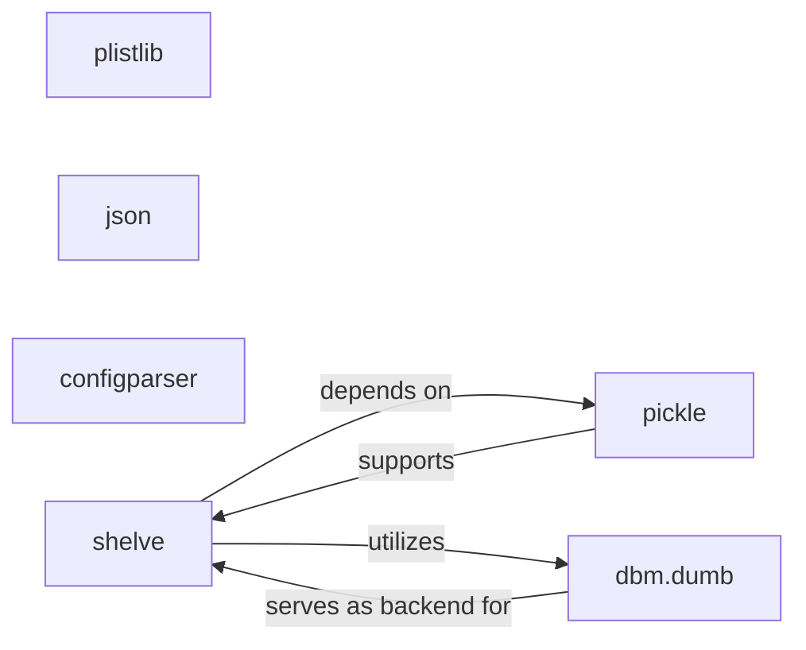

## Details

This subsystem focuses on data serialization, deserialization, and persistent storage, crucial for managing application settings and complex Python objects. It leverages standard Python libraries like `json`, `plistlib`, `configparser`, `shelve`, `pickle`, and `dbm.dumb` to handle various data formats and storage needs. The core interaction pathways involve `shelve` utilizing `pickle` for object serialization and `dbm.dumb` as its underlying storage mechanism, while `configparser`, `json`, and `plistlib` manage specific configuration and data interchange formats independently.

### plistlib
Specializes in reading from and writing to Apple Property List (.plist) files. This is critical for handling iOS-native configuration and data, ensuring compatibility with the iOS environment.

**Related Classes/Methods**:

- <a href="https://github.com/xuan32546/IOS13-SimulateTouch/blob/master/" target="_blank" rel="noopener noreferrer">`plistlib`</a>

### json
Provides functionality for encoding and decoding JSON (JavaScript Object Notation) data. It is versatile for general data interchange, structured data storage, and API communication.

**Related Classes/Methods**:

- <a href="https://github.com/xuan32546/IOS13-SimulateTouch/blob/master/" target="_blank" rel="noopener noreferrer">`json`</a>

### configparser
Manages application settings by reading from and writing to INI-style configuration files. It provides a structured way to handle application-specific parameters.

**Related Classes/Methods**:

- <a href="https://github.com/xuan32546/IOS13-SimulateTouch/blob/master/layout/usr/lib/python3.7/configparser.py#L559-L1186" target="_blank" rel="noopener noreferrer">`configparser`:559-1186</a>

### shelve
Offers a dictionary-like interface for persistent storage of arbitrary Python objects. It abstracts the underlying storage mechanism, allowing developers to easily save and retrieve complex data structures.

**Related Classes/Methods**:

- <a href="https://github.com/xuan32546/IOS13-SimulateTouch/blob/master/" target="_blank" rel="noopener noreferrer">`shelve`</a>

### pickle
A core component for serializing and deserializing arbitrary Python object structures. It is fundamental for `shelve` to store and retrieve Python objects.

**Related Classes/Methods**:

- <a href="https://github.com/xuan32546/IOS13-SimulateTouch/blob/master/layout/usr/lib/python3.7/copyreg.py#L12-L20" target="_blank" rel="noopener noreferrer">`pickle`:12-20</a>

### dbm.dumb
Offers a basic, file-based key-value storage mechanism. It often serves as an underlying storage engine for `shelve` when more sophisticated database solutions are not required.

**Related Classes/Methods**:

- <a href="https://github.com/xuan32546/IOS13-SimulateTouch/blob/master/" target="_blank" rel="noopener noreferrer">`dbm.dumb`</a>

### [FAQ](https://github.com/CodeBoarding/GeneratedOnBoardings/tree/main?tab=readme-ov-file#faq)