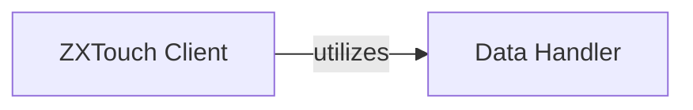

## Details

The ZXTouch client-side subsystem is centered around the ZXTouch Client component, which serves as the primary interface for users to interact with the iOS Daemon. This component is responsible for managing the network connection, orchestrating high-level command execution, and coordinating the overall communication flow. It relies heavily on the Data Handler component to perform the crucial tasks of serializing command parameters into a transmittable format and deserializing received responses, ensuring data integrity and compatibility with the server-side protocol. This architecture consolidates the core client functionalities within the ZXTouch Client, with the Data Handler providing essential, dedicated data transformation services.

### ZXTouch Client
The primary interface for users to interact with the iOS Daemon. This component is responsible for managing the network connection, orchestrating high-level command execution, and coordinating the overall communication flow. It embodies the responsibilities of the Python Client Library (high-level API), API Wrapper (serialization/deserialization orchestration), and Communication Client (network management).

**Related Classes/Methods**:

- <a href="https://github.com/xuan32546/IOS13-SimulateTouch/blob/master/layout/usr/lib/python3.7/site-packages/zxtouch/client.py#L10-L403" target="_blank" rel="noopener noreferrer">`zxtouch.client.zxtouch`:10-403</a>
- <a href="https://github.com/xuan32546/IOS13-SimulateTouch/blob/master/layout/usr/lib/python3.7/socket.py#L133-L455" target="_blank" rel="noopener noreferrer">`socket.socket`:133-455</a>
- <a href="https://github.com/xuan32546/IOS13-SimulateTouch/blob/master/layout/usr/lib/python3.7/site-packages/zxtouch/datahandler.py#L1-L8" target="_blank" rel="noopener noreferrer">`zxtouch.datahandler.format_socket_data`:1-8</a>
- <a href="https://github.com/xuan32546/IOS13-SimulateTouch/blob/master/layout/usr/lib/python3.7/site-packages/zxtouch/datahandler.py#L10-L26" target="_blank" rel="noopener noreferrer">`zxtouch.datahandler.decode_socket_data`:10-26</a>

### Data Handler
Responsible solely for the actual byte-level formatting and parsing of messages, performing the crucial tasks of serializing command parameters into a transmittable format and deserializing received responses, ensuring data integrity and compatibility with the server-side protocol.

**Related Classes/Methods**:

- <a href="https://github.com/xuan32546/IOS13-SimulateTouch/blob/master/layout/usr/lib/python3.7/site-packages/zxtouch/datahandler.py#L1-L8" target="_blank" rel="noopener noreferrer">`zxtouch.datahandler.format_socket_data`:1-8</a>
- <a href="https://github.com/xuan32546/IOS13-SimulateTouch/blob/master/layout/usr/lib/python3.7/site-packages/zxtouch/datahandler.py#L10-L26" target="_blank" rel="noopener noreferrer">`zxtouch.datahandler.decode_socket_data`:10-26</a>

### [FAQ](https://github.com/CodeBoarding/GeneratedOnBoardings/tree/main?tab=readme-ov-file#faq)