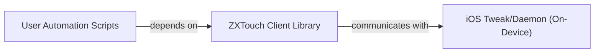

## Details

The system facilitates iOS device automation through a client-server architecture. User Automation Scripts, written in Python, serve as the high-level interface, encapsulating specific automation logic. These scripts leverage the ZXTouch Client Library, a core Python component that acts as both an API wrapper and a communication client. The ZXTouch Client Library provides a simplified programmatic interface for various device interactions (e.g., touch, keyboard input, screen information) and is responsible for establishing and managing the underlying TCP/IP socket connection to an iOS Tweak/Daemon running on the target device. This daemon, residing on the iOS device, receives commands from the client, executes them, and sends back responses, enabling seamless remote control and automation of iOS functionalities.

### User Automation Scripts
High-level, user-defined Python scripts that encapsulate specific automation logic and translate actions into calls to the ZXTouch Client Library.

**Related Classes/Methods**:

- <a href="https://github.com/xuan32546/IOS13-SimulateTouch/blob/master/Example-Scripts/Touch Simulation.bdl/simulate_touch.py" target="_blank" rel="noopener noreferrer">`simulate_touch.py`</a>
- <a href="https://github.com/xuan32546/IOS13-SimulateTouch/blob/master/Example-Scripts/Text Input and MORE.bdl/keyboard-test.py" target="_blank" rel="noopener noreferrer">`keyboard-test.py`</a>

### ZXTouch Client Library
Central component providing a high-level programmatic interface for User Automation Scripts to interact with the iOS device, managing network connection and handling command serialization/deserialization.

**Related Classes/Methods**:

- <a href="https://github.com/xuan32546/IOS13-SimulateTouch/blob/master/layout/usr/lib/python3.7/site-packages/zxtouch/client.py#L10-L403" target="_blank" rel="noopener noreferrer">`layout.usr.lib.python3.7.site-packages.zxtouch.client.zxtouch`:10-403</a>

### iOS Tweak/Daemon (On-Device)
On-device component that receives commands from the client, executes them, and sends back responses for iOS automation.

**Related Classes/Methods**: _None_

### [FAQ](https://github.com/CodeBoarding/GeneratedOnBoardings/tree/main?tab=readme-ov-file#faq)