```mermaid
graph LR
    iOS_Daemon_Tweak["iOS Daemon/Tweak"]
    Command_Listener_Deserializer["Command Listener & Deserializer"]
    Event_Translation_Engine["Event Translation Engine"]
    iOS_Event_Injector["iOS Event Injector"]
    System_Interaction_Modules["System Interaction Modules"]
    CommunicationClient["CommunicationClient"]
    TouchSimulationAPI["TouchSimulationAPI"]
    ControlScripts["ControlScripts"]
    iOS_OS["iOS OS"]
    ControlScripts -- "utilizes" --> TouchSimulationAPI
    TouchSimulationAPI -- "sends commands to" --> CommunicationClient
    Command_Listener_Deserializer -- "passes parsed commands to" --> Event_Translation_Engine
    Event_Translation_Engine -- "sends translated events to" --> iOS_Event_Injector
    iOS_Event_Injector -- "utilizes" --> System_Interaction_Modules
    iOS_Event_Injector -- "injects events into" --> iOS_OS
    CommunicationClient -- "sends commands to" --> Command_Listener_Deserializer
    click iOS_Daemon_Tweak href "https://github.com/CodeBoarding/GeneratedOnBoardings/blob/main/IOS13-SimulateTouch/iOS_Daemon_Tweak.md" "Details"
```

## Details

The system facilitates remote control and automation of iOS devices. On the client-side, ControlScripts leverage the TouchSimulationAPI to define high-level automation commands. These commands are then serialized and transmitted by the CommunicationClient over a network connection. On the iOS device, the iOS Daemon/Tweak acts as the central processing unit. It comprises a Command Listener & Deserializer that receives and parses incoming commands. The Event Translation Engine then converts these high-level commands into specific, low-level iOS event structures. Finally, the iOS Event Injector, supported by System Interaction Modules, directly injects these synthesized events into the iOS OS, simulating user interaction. This architecture enables external applications to programmatically control an iOS device by simulating touch and other input events.

### iOS Daemon/Tweak [[Expand]](./iOS_Daemon_Tweak.md)
The core on-device server component operating as a persistent background process (daemon/tweak) on the iOS device. It orchestrates the reception of commands, their translation into low-level iOS events, and their injection into the operating system.

**Related Classes/Methods**:

- <a href="https://github.com/xuan32546/IOS13-SimulateTouch/blob/master/appdelegate/Tweak.xm#L1-L22" target="_blank" rel="noopener noreferrer">`Tweak.xm`:1-22</a>

### Command Listener & Deserializer
Responsible for setting up the network socket, listening for incoming connections and raw command data from the CommunicationClient, and then parsing/deserializing this data into a structured, usable format for internal processing.

**Related Classes/Methods**:

- <a href="https://github.com/xuan32546/IOS13-SimulateTouch/blob/master/appdelegate/Tweak.xm#L1-L22" target="_blank" rel="noopener noreferrer">`Tweak.xm`:1-22</a>

### Event Translation Engine
Takes the deserialized high-level commands (e.g., "tap at X,Y", "swipe from A to B") and translates them into the specific, low-level iOS event structures and sequences required by the operating system's event dispatching mechanisms. This component bridges the abstract command layer with the concrete iOS event model.

**Related Classes/Methods**:

- <a href="https://github.com/xuan32546/IOS13-SimulateTouch/blob/master/appdelegate/Tweak.xm#L1-L22" target="_blank" rel="noopener noreferrer">`Tweak.xm`:1-22</a>

### iOS Event Injector
This is the critical component that utilizes private or public iOS APIs (often through hooking mechanisms) to inject the synthesized touch events directly into the iOS operating system's event dispatching pipeline. It ensures that the OS processes these simulated events as if they originated from actual user input.

**Related Classes/Methods**:

- <a href="https://github.com/xuan32546/IOS13-SimulateTouch/blob/master/appdelegate/Tweak.xm#L1-L22" target="_blank" rel="noopener noreferrer">`Tweak.xm`:1-22</a>
- <a href="https://github.com/xuan32546/IOS13-SimulateTouch/blob/master/appdelegate/UIKeyboard.xm#L1-L10" target="_blank" rel="noopener noreferrer">`UIKeyboard.xm`:1-10</a>

### System Interaction Modules
These are the concrete Objective-C/C/C++ source files that implement the low-level hooks, function overrides, and direct API calls necessary to interact with iOS frameworks like UIKit and SpringBoard. Tweak.xm likely contains the primary event injection and general system manipulation logic, while UIKeyboard.xm specifically handles keyboard-related event simulation and interaction.

**Related Classes/Methods**: _None_

### CommunicationClient
(Client-side) Responsible for establishing and maintaining communication with the iOS Daemon/Tweak. It serializes high-level commands from the TouchSimulationAPI and sends them over the network to the daemon.

**Related Classes/Methods**:

- <a href="https://github.com/xuan32546/IOS13-SimulateTouch/blob/master/Example-Scripts/Touch Simulation.bdl/simulate_touch.py#L1-L100" target="_blank" rel="noopener noreferrer">`simulate_touch.py`:1-100</a>

### TouchSimulationAPI
(Client-side) Provides a high-level abstraction for touch actions and other automation commands. It translates user-friendly API calls into structured commands suitable for transmission to the CommunicationClient.

**Related Classes/Methods**:

- <a href="https://github.com/xuan32546/IOS13-SimulateTouch/blob/master/Example-Scripts/Touch Simulation.bdl/simulate_touch.py#L1-L100" target="_blank" rel="noopener noreferrer">`simulate_touch.py`:1-100</a>

### ControlScripts
(Client-side) User-defined scripts or applications that utilize the TouchSimulationAPI to orchestrate complex automation sequences, tests, or interactive controls on the iOS device.

**Related Classes/Methods**:

- <a href="https://github.com/xuan32546/IOS13-SimulateTouch/blob/master/Example-Scripts/Touch Simulation.bdl/simulate_touch.py#L1-L100" target="_blank" rel="noopener noreferrer">`simulate_touch.py`:1-100</a>

### iOS OS
The underlying iOS operating system (versions 11.0 - 14) which is the target environment for event injection. It receives and processes the simulated touch events, leading to UI changes and application interactions. This is an external dependency that the iOS Daemon/Tweak interacts with.

**Related Classes/Methods**: _None_

### [FAQ](https://github.com/CodeBoarding/GeneratedOnBoardings/tree/main?tab=readme-ov-file#faq)