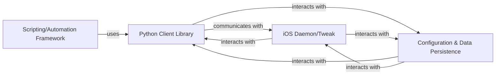

## Details

The project's architecture is structured around a client-server model, enabling automated interaction with iOS devices. The Scripting/Automation Framework allows users to define and execute automated tasks using Python scripts. These scripts leverage the Python Client Library to communicate with the iOS Daemon/Tweak, which runs on the iOS device. The Python Client Library handles the serialization of commands and network communication, sending instructions to the iOS Daemon. The iOS Daemon/Tweak is responsible for receiving these commands, deserializing them, and injecting them as low-level touch and keyboard events into the iOS operating system. The Configuration & Data Persistence component manages the storage and retrieval of recorded touch sequences and application settings, supporting both on-device and off-device data management, which can be utilized by both the Python Client Library for recording/playback and the iOS Daemon for its operational data.

### Python Client Library [[Expand]](./Python_Client_Library.md)
Provides a high-level API for users and scripts to interact with the iOS Daemon. It handles command creation, serialization, network communication, and manages recording/playback of touch data.

**Related Classes/Methods**:

- <a href="https://github.com/xuan32546/IOS13-SimulateTouch/blob/master/layout/usr/lib/python3.7/site-packages/zxtouch/client.py" target="_blank" rel="noopener noreferrer">`zxtouch.client`</a>
- <a href="https://github.com/xuan32546/IOS13-SimulateTouch/blob/master/layout/usr/lib/python3.7/site-packages/zxtouch/datahandler.py" target="_blank" rel="noopener noreferrer">`zxtouch.datahandler`</a>

### iOS Daemon/Tweak [[Expand]](./iOS_Daemon_Tweak.md)
The on-device server component responsible for listening for commands, deserializing them, translating them into low-level iOS touch events, and injecting these events into the iOS operating system.

**Related Classes/Methods**:

- <a href="https://github.com/xuan32546/IOS13-SimulateTouch/blob/master/appdelegate/Tweak.xm" target="_blank" rel="noopener noreferrer">`Tweak.xm`</a>
- <a href="https://github.com/xuan32546/IOS13-SimulateTouch/blob/master/appdelegate/UIKeyboard.xm" target="_blank" rel="noopener noreferrer">`UIKeyboard.xm`</a>

### Configuration & Data Persistence [[Expand]](./Configuration_Data_Persistence.md)
Manages the storage and retrieval of recorded touch sequences, application settings, and other persistent data, supporting both on-device and off-device storage.

**Related Classes/Methods**: _None_

### Scripting/Automation Framework [[Expand]](./Scripting_Automation_Framework.md)
Represents the collection of user-defined Python scripts and their bundling mechanisms that leverage the Python Client Library to define and execute automated tasks on the iOS device.

**Related Classes/Methods**:

- <a href="https://github.com/xuan32546/IOS13-SimulateTouch/blob/master/Example-Scripts/Touch Simulation.bdl/simulate_touch.py" target="_blank" rel="noopener noreferrer">`simulate_touch.py`</a>
- <a href="https://github.com/xuan32546/IOS13-SimulateTouch/blob/master/Example-Scripts/Text Input and MORE.bdl/keyboard-test.py" target="_blank" rel="noopener noreferrer">`keyboard-test.py`</a>

### [FAQ](https://github.com/CodeBoarding/GeneratedOnBoardings/tree/main?tab=readme-ov-file#faq)