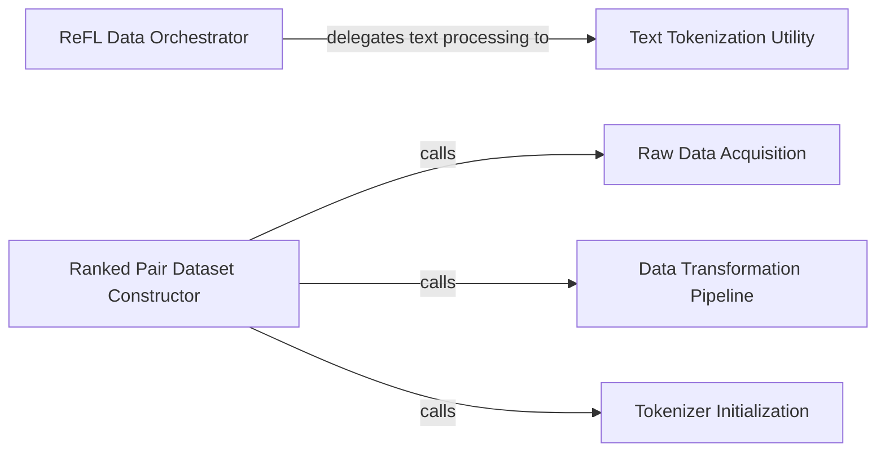

## Details

The `ImageReward` project's ReFL subsystem focuses on preparing and processing data for training. The `ReFL Data Orchestrator` (represented by the `main` function in `ImageReward.ReFL`) acts as the central control, initiating the data pipeline. A key dependency for text processing is the `Text Tokenization Utility` (utilizing `transformers.CLIPTokenizer`), which converts raw text into a machine-readable format. The `Ranked Pair Dataset Constructor` is crucial for building the training dataset, relying on `Raw Data Acquisition` to obtain initial data, the `Data Transformation Pipeline` for necessary preprocessing, and `Tokenizer Initialization` to ensure text data is correctly prepared for model input. This structured flow ensures efficient and accurate data preparation for the ReFL training module.

### ReFL Data Orchestrator
Serves as the high-level coordinator for data preprocessing specifically for the ReFL training module. It initiates and manages the overall flow of preparing ReFL-specific training data.

**Related Classes/Methods**:

- <a href="https://github.com/zai-org/ImageReward/blob/main/ImageReward/ReFL.py" target="_blank" rel="noopener noreferrer">`ImageReward.ReFL.main`</a>

### Text Tokenization Utility
A specialized utility component dedicated to converting raw text captions into tokenized formats. This is a fundamental text preprocessing step, ensuring text data is machine-readable for models.

**Related Classes/Methods**:

- <a href="https://github.com/zai-org/ImageReward/blob/main/ImageReward/ReFL.py" target="_blank" rel="noopener noreferrer">`transformers.CLIPTokenizer`</a>

### Ranked Pair Dataset Constructor
The core component responsible for initializing and orchestrating the creation of the `rank_pair_dataset`. It encapsulates the logic for building a dataset of ranked image-text pairs, which is crucial for training.

**Related Classes/Methods**:

- <a href="https://github.com/zai-org/ImageReward/blob/main/train/src/rank_pair_dataset.py" target="_blank" rel="noopener noreferrer">`train.src.rank_pair_dataset:Ranked Pair Dataset Constructor`</a>

### Raw Data Acquisition
Handles the process of obtaining raw data, either by loading it from storage or generating it, to form the basis of the ranked image-text pairs. This component is the entry point for raw data into the system.

**Related Classes/Methods**:

- <a href="https://github.com/zai-org/ImageReward/blob/main/train/src/rank_pair_dataset.py" target="_blank" rel="noopener noreferrer">`train.src.rank_pair_dataset:Raw Data Acquisition`</a>

### Data Transformation Pipeline
Applies essential data transformations, such as image resizing, normalization, and text formatting, to ensure data consistency and prepare it into a format directly consumable by machine learning models.

**Related Classes/Methods**:

- <a href="https://github.com/zai-org/ImageReward/blob/main/train/src/rank_pair_dataset.py" target="_blank" rel="noopener noreferrer">`train.src.rank_pair_dataset:Data Transformation Pipeline`</a>

### Tokenizer Initialization
Initializes the specific tokenizer instance required for processing the text components within the `rank_pair_dataset`. This ensures that text data is correctly prepared and aligned with the model's input requirements.

**Related Classes/Methods**:

- <a href="https://github.com/zai-org/ImageReward/blob/main/train/src/rank_pair_dataset.py" target="_blank" rel="noopener noreferrer">`train.src.rank_pair_dataset:Tokenizer Initialization`</a>

### [FAQ](https://github.com/CodeBoarding/GeneratedOnBoardings/tree/main?tab=readme-ov-file#faq)