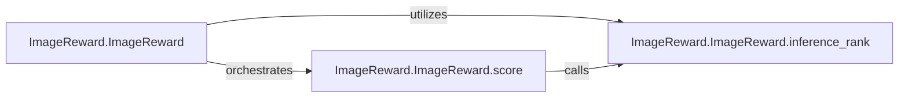

## Details

The `ImageReward` subsystem is designed around a central `ImageReward.ImageReward` class, acting as the primary interface for image scoring. This class orchestrates the entire process, from model loading to the final ranking. The `score` method within `ImageReward.ImageReward` serves as the public entry point, handling input preparation and coordinating the core ranking logic. The `inference_rank` method, a critical internal component, performs the actual deep learning inference, processing image and text inputs to generate rewards and rankings. This clear separation of concerns allows for a modular and efficient image scoring pipeline.

### ImageReward.ImageReward
This class serves as the central orchestrator and entry point for the entire ImageReward scoring functionality. It encapsulates model loading, device management, and the overall workflow for calculating image scores. It embodies the "Model-as-a-Library" pattern by providing a callable interface for inference.

**Related Classes/Methods**:

- <a href="https://github.com/zai-org/ImageReward/blob/main/ImageReward/ImageReward.py#L103-L136" target="_blank" rel="noopener noreferrer">`ImageReward.ImageReward.score`:103-136</a>
- <a href="https://github.com/zai-org/ImageReward/blob/main/ImageReward/ImageReward.py#L139-L174" target="_blank" rel="noopener noreferrer">`ImageReward.ImageReward.inference_rank`:139-174</a>

### ImageReward.ImageReward.score
This method is the primary public interface for the ImageReward Scoring Engine. It takes input prompts and images, prepares them for inference, and coordinates the execution of the core ranking logic. It represents the "ML Pipeline" aspect by defining the sequence of operations for scoring.

**Related Classes/Methods**:

- <a href="https://github.com/zai-org/ImageReward/blob/main/ImageReward/ImageReward.py#L139-L174" target="_blank" rel="noopener noreferrer">`ImageReward.ImageReward.inference_rank`:139-174</a>

### ImageReward.ImageReward.inference_rank
This method performs the actual deep learning inference using the loaded ImageReward model to rank images. It is the computational heavy-lifting component within the scoring pipeline, responsible for executing the core ranking algorithm. It processes text and image inputs, encodes them using the BLIP model, and then uses an MLP to calculate rewards and rank the images.

**Related Classes/Methods**:

- <a href="https://github.com/zai-org/ImageReward/blob/main/ImageReward/ImageReward.py#L139-L174" target="_blank" rel="noopener noreferrer">`ImageReward.ImageReward.inference_rank`:139-174</a>

### [FAQ](https://github.com/CodeBoarding/GeneratedOnBoardings/tree/main?tab=readme-ov-file#faq)