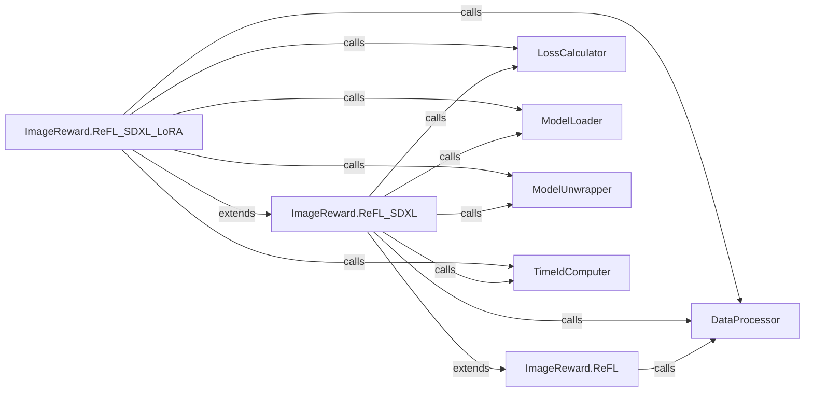

## Details

The ImageReward project's fine-tuning subsystem is built around a hierarchical structure of Reinforcement Learning from Human Feedback (ReFL) algorithms. The foundational ImageReward.ReFL component orchestrates the core training loop, handling general data preparation and tokenization through interactions with the DataProcessor. Specialized variants, ImageReward.ReFL_SDXL and ImageReward.ReFL_SDXL_LoRA, extend this base functionality to support SDXL models, with the latter incorporating LoRA for efficient fine-tuning. These specialized components heavily rely on the ModelLoader for instantiating appropriate model architectures, the LossCalculator for computing pre-training and reward-based losses, and the TimeIdComputer for generating time-dependent inputs crucial for SDXL. Furthermore, the ModelUnwrapper plays a vital role in managing model states, especially when dealing with wrapped models or LoRA adapters during training and saving operations. This modular design allows for flexible adaptation to different model architectures and training strategies while maintaining a clear separation of concerns.

### ImageReward.ReFL
Implements the generic Reinforcement Learning from Human Feedback (ReFL) fine-tuning process for the ImageReward model. It orchestrates the fundamental training loop, including data preparation and tokenization.

**Related Classes/Methods**:

- <a href="https://github.com/zai-org/ImageReward/blob/main/ImageReward/ReFL.py" target="_blank" rel="noopener noreferrer">`ImageReward.ReFL`</a>

### ImageReward.ReFL_SDXL
Extends the base ImageReward.ReFL functionality to specifically support fine-tuning of SDXL models. It integrates SDXL-specific model loading, computes pre-training and reward losses tailored for SDXL, and handles time ID generation.

**Related Classes/Methods**:

- <a href="https://github.com/zai-org/ImageReward/blob/main/ImageReward/ReFL_SDXL.py" target="_blank" rel="noopener noreferrer">`ImageReward.ReFL_SDXL`</a>

### ImageReward.ReFL_SDXL_LoRA
Further specializes ImageReward.ReFL_SDXL to incorporate LoRA (Low-Rank Adaptation) for efficient fine-tuning of SDXL models. It manages LoRA-specific model saving and loading hooks and handles validation metric logging.

**Related Classes/Methods**:

- <a href="https://github.com/zai-org/ImageReward/blob/main/ImageReward/ReFL_SDXL_LoRA.py" target="_blank" rel="noopener noreferrer">`ImageReward.ReFL_SDXL_LoRA`</a>

### DataProcessor
Encapsulates data preparation logic, including caption tokenization and general data transformations required across different ReFL training variants.

**Related Classes/Methods**:

- <a href="https://github.com/zai-org/ImageReward/blob/main/" target="_blank" rel="noopener noreferrer">`transformers.CLIPTokenizer`</a>
- <a href="https://github.com/zai-org/ImageReward/blob/main/" target="_blank" rel="noopener noreferrer">`datasets.load_dataset`</a>
- <a href="https://github.com/zai-org/ImageReward/blob/main/" target="_blank" rel="noopener noreferrer">`torchvision.transforms.Compose`</a>

### LossCalculator
Provides methods for computing the various loss components, specifically pre-training loss and reward-based loss, which are critical for guiding the fine-tuning process.

**Related Classes/Methods**:

- <a href="https://github.com/zai-org/ImageReward/blob/main/" target="_blank" rel="noopener noreferrer">`torch.nn.functional.mse_loss`</a>
- <a href="https://github.com/zai-org/ImageReward/blob/main/ImageReward/ImageReward.py#L71-L174" target="_blank" rel="noopener noreferrer">`ImageReward.ImageReward.ImageReward`:71-174</a>

### ModelLoader
Handles the dynamic loading of model classes from specified paths, ensuring the correct model architecture is instantiated for training.

**Related Classes/Methods**:

- <a href="https://github.com/zai-org/ImageReward/blob/main/" target="_blank" rel="noopener noreferrer">`diffusers.AutoencoderKL.from_pretrained`</a>
- <a href="https://github.com/zai-org/ImageReward/blob/main/" target="_blank" rel="noopener noreferrer">`diffusers.UNet2DConditionModel.from_pretrained`</a>
- <a href="https://github.com/zai-org/ImageReward/blob/main/" target="_blank" rel="noopener noreferrer">`transformers.CLIPTextModel.from_pretrained`</a>

### ModelUnwrapper
Facilitates model state management, particularly for unwrapping models (e.g., those with LoRA adapters) during training and saving operations.

**Related Classes/Methods**:

- <a href="https://github.com/zai-org/ImageReward/blob/main/" target="_blank" rel="noopener noreferrer">`accelerate.Accelerator.unwrap_model`</a>

### TimeIdComputer
Calculates time-dependent identifiers, which are essential inputs for specific SDXL loss computations.

**Related Classes/Methods**:

- <a href="https://github.com/zai-org/ImageReward/blob/main/" target="_blank" rel="noopener noreferrer">`diffusers.DDPMScheduler.timesteps`</a>

### [FAQ](https://github.com/CodeBoarding/GeneratedOnBoardings/tree/main?tab=readme-ov-file#faq)