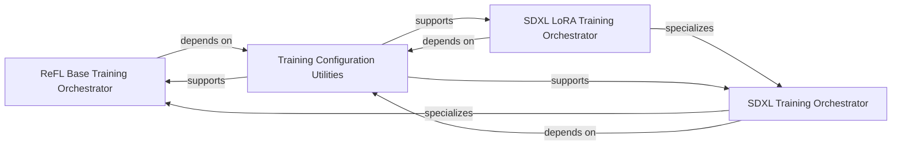

## Details

The `Training Orchestration & Configuration` subsystem is central to initiating, configuring, and managing the overall training process within the ImageReward project, including distributed training setup and command-line argument handling.

### ReFL Base Training Orchestrator
Manages the fundamental training process for the ImageReward model, including data preparation and transformations. It serves as the base for more specialized training pipelines.

**Related Classes/Methods**:

- <a href="https://github.com/zai-org/ImageReward/blob/main/refl.py" target="_blank" rel="noopener noreferrer">`ImageReward.ReFL`</a>

### SDXL Training Orchestrator
Orchestrates training specifically for the SDXL model variant. This includes handling SDXL-specific model initialization, loss computation, and managing the training loop.

**Related Classes/Methods**:

- <a href="https://github.com/zai-org/ImageReward/blob/main/refl_sdxl.py" target="_blank" rel="noopener noreferrer">`ImageReward.ReFL_SDXL`</a>

### SDXL LoRA Training Orchestrator
Extends the SDXL Training Orchestrator to manage LoRA fine-tuning. This component handles LoRA-specific model persistence, loss calculations, and validation logging.

**Related Classes/Methods**:

- <a href="https://github.com/zai-org/ImageReward/blob/main/refl_sdxl_lora.py" target="_blank" rel="noopener noreferrer">`ImageReward.ReFL_SDXL_LoRA`</a>

### Training Configuration Utilities
Provides essential utility functions for managing the training environment. This includes handling file paths, creating necessary directories, and determining distributed training ranks.

**Related Classes/Methods**:

- <a href="https://github.com/zai-org/ImageReward/blob/main/train/src/config/utils.py" target="_blank" rel="noopener noreferrer">`train.src.config.utils`</a>

### [FAQ](https://github.com/CodeBoarding/GeneratedOnBoardings/tree/main?tab=readme-ov-file#faq)