```mermaid
graph LR
    ImageReward_Scoring_Engine["ImageReward Scoring Engine"]
    Specialized_Image_Scoring_Models["Specialized Image Scoring Models"]
    ReFL_Fine_tuning_Module["ReFL Fine-tuning Module"]
    Data_Management_Preprocessing["Data Management & Preprocessing"]
    Model_Persistence_Utilities["Model Persistence & Utilities"]
    Training_Orchestration_Configuration["Training Orchestration & Configuration"]
    Training_Orchestration_Configuration -- "initiates and configures" --> ReFL_Fine_tuning_Module
    Training_Orchestration_Configuration -- "configures and initiates data preparation within" --> Data_Management_Preprocessing
    Training_Orchestration_Configuration -- "manages model loading and saving paths via" --> Model_Persistence_Utilities
    ReFL_Fine_tuning_Module -- "consumes prepared datasets from" --> Data_Management_Preprocessing
    ReFL_Fine_tuning_Module -- "loads initial models and saves fine-tuned models through" --> Model_Persistence_Utilities
    ReFL_Fine_tuning_Module -- "fine-tunes the underlying components of" --> ImageReward_Scoring_Engine
    ImageReward_Scoring_Engine -- "delegates specific scoring tasks to" --> Specialized_Image_Scoring_Models
    ImageReward_Scoring_Engine -- "loads necessary models for inference via" --> Model_Persistence_Utilities
    Specialized_Image_Scoring_Models -- "provide their computed scores back to" --> ImageReward_Scoring_Engine
    Specialized_Image_Scoring_Models -- "load their respective model weights using" --> Model_Persistence_Utilities
    click ImageReward_Scoring_Engine href "https://github.com/CodeBoarding/GeneratedOnBoardings/blob/main/ImageReward/ImageReward_Scoring_Engine.md" "Details"
    click ReFL_Fine_tuning_Module href "https://github.com/CodeBoarding/GeneratedOnBoardings/blob/main/ImageReward/ReFL_Fine_tuning_Module.md" "Details"
    click Data_Management_Preprocessing href "https://github.com/CodeBoarding/GeneratedOnBoardings/blob/main/ImageReward/Data_Management_Preprocessing.md" "Details"
    click Training_Orchestration_Configuration href "https://github.com/CodeBoarding/GeneratedOnBoardings/blob/main/ImageReward/Training_Orchestration_Configuration.md" "Details"
```

## Details

The `ImageReward` architecture is designed as a modular ML toolkit, centered around its `ImageReward Scoring Engine` for evaluating image quality. This engine dynamically integrates scores from various `Specialized Image Scoring Models` (Aesthetic, BLIP, CLIP) to produce a unified reward. For continuous improvement, the `ReFL Fine-tuning Module` enables model adaptation through reinforcement learning, relying on `Data Management & Preprocessing` for robust dataset handling. The entire lifecycle, from initial model loading to saving fine-tuned versions, is supported by `Model Persistence & Utilities`, with `Training Orchestration & Configuration` providing the top-level control for training workflows. This structure facilitates clear separation of concerns, enabling independent development and efficient data flow for both inference and training.

### ImageReward Scoring Engine [[Expand]](./ImageReward_Scoring_Engine.md)
The central component responsible for orchestrating the calculation of the final ImageReward score by integrating outputs from various specialized scoring models.

**Related Classes/Methods**:

- <a href="https://github.com/zai-org/ImageReward/blob/main/ImageReward/ImageReward.py#L103-L136" target="_blank" rel="noopener noreferrer">`ImageReward.ImageReward.score`:103-136</a>

### Specialized Image Scoring Models
A collection of distinct sub-models (Aesthetic, BLIP, CLIP) that provide individual, specialized scores for images, serving as foundational inputs to the ImageReward Scoring Engine.

**Related Classes/Methods**:

- <a href="https://github.com/zai-org/ImageReward/blob/main/ImageReward/models/AestheticScore.py#L61-L75" target="_blank" rel="noopener noreferrer">`ImageReward.models.AestheticScore.score`:61-75</a>
- <a href="https://github.com/zai-org/ImageReward/blob/main/ImageReward/models/BLIPScore.py#L50-L70" target="_blank" rel="noopener noreferrer">`ImageReward.models.BLIPScore.score`:50-70</a>
- <a href="https://github.com/zai-org/ImageReward/blob/main/ImageReward/models/CLIPScore.py#L33-L51" target="_blank" rel="noopener noreferrer">`ImageReward.models.CLIPScore.score`:33-51</a>

### ReFL Fine-tuning Module [[Expand]](./ReFL_Fine_tuning_Module.md)
Implements the Reinforcement Learning from Human Feedback (ReFL) process, enabling the fine-tuning of the ImageReward model, including specialized variants for SDXL integration.

**Related Classes/Methods**:

- <a href="https://github.com/zai-org/ImageReward/blob/main/ImageReward/ReFL.py#L656-L825" target="_blank" rel="noopener noreferrer">`ImageReward.ReFL.train`:656-825</a>
- <a href="https://github.com/zai-org/ImageReward/blob/main/ImageReward/ReFL_SDXL.py#L980-L1154" target="_blank" rel="noopener noreferrer">`ImageReward.ReFL_SDXL.train`:980-1154</a>
- <a href="https://github.com/zai-org/ImageReward/blob/main/ImageReward/ReFL_SDXL_LoRA.py#L1117-L1283" target="_blank" rel="noopener noreferrer">`ImageReward.ReFL_SDXL_LoRA.train`:1117-1283</a>

### Data Management & Preprocessing [[Expand]](./Data_Management_Preprocessing.md)
Handles the entire lifecycle of data preparation, from loading raw image and text data to transforming it into structured datasets suitable for model training and inference.

**Related Classes/Methods**:

- <a href="https://github.com/zai-org/ImageReward/blob/main/ImageReward/ReFL.py#L576-L580" target="_blank" rel="noopener noreferrer">`ImageReward.ReFL.preprocess_train`:576-580</a>
- <a href="https://github.com/zai-org/ImageReward/blob/main/train/src/rank_pair_dataset.py#L48-L61" target="_blank" rel="noopener noreferrer">`train.src.rank_pair_dataset.__init__`:48-61</a>

### Model Persistence & Utilities
Provides essential functionalities for managing model states, including loading pre-trained weights, saving fine-tuned models, and other general model-related utility operations.

**Related Classes/Methods**:

- <a href="https://github.com/zai-org/ImageReward/blob/main/ImageReward/utils.py#L45-L83" target="_blank" rel="noopener noreferrer">`ImageReward.utils.load`:45-83</a>
- <a href="https://github.com/zai-org/ImageReward/blob/main/ImageReward/utils.py#L123-L167" target="_blank" rel="noopener noreferrer">`ImageReward.utils.load_score`:123-167</a>
- <a href="https://github.com/zai-org/ImageReward/blob/main/train/src/config/utils.py#L27-L32" target="_blank" rel="noopener noreferrer">`train.src.config.utils.save_model`:27-32</a>
- <a href="https://github.com/zai-org/ImageReward/blob/main/train/src/config/utils.py#L35-L50" target="_blank" rel="noopener noreferrer">`train.src.config.utils.load_model`:35-50</a>

### Training Orchestration & Configuration [[Expand]](./Training_Orchestration_Configuration.md)
The top-level entry points and modules responsible for initiating, configuring, and managing the overall training process, including setting up distributed training and handling command-line arguments.

**Related Classes/Methods**:

- <a href="https://github.com/zai-org/ImageReward/blob/main/refl.py" target="_blank" rel="noopener noreferrer">`refl.py`</a>
- <a href="https://github.com/zai-org/ImageReward/blob/main/refl_sdxl.py" target="_blank" rel="noopener noreferrer">`refl_sdxl.py`</a>
- <a href="https://github.com/zai-org/ImageReward/blob/main/refl_sdxl_lora.py" target="_blank" rel="noopener noreferrer">`refl_sdxl_lora.py`</a>
- <a href="https://github.com/zai-org/ImageReward/blob/main/train/src/config/utils.py" target="_blank" rel="noopener noreferrer">`train.src.config.utils.py`</a>

### [FAQ](https://github.com/CodeBoarding/GeneratedOnBoardings/tree/main?tab=readme-ov-file#faq)