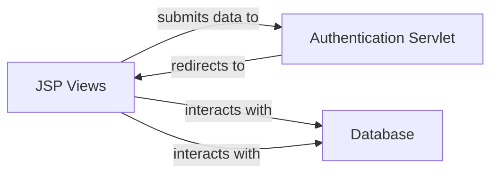

## Details

The JspChat application exhibits a simplified architectural style, primarily driven by JavaServer Pages (JSPs) that handle both presentation and significant portions of business logic and data access. A dedicated servlet manages the initial login request, but much of the core user management functionality is embedded directly within the JSP files. The subsystem under analysis is defined by the JspChat project's web content (WebContent directory) and its core Java servlet (src/com/hjy/web/servlet).

### JSP Views
This component encompasses all JavaServer Pages (`.jsp` files) responsible for rendering the user interface. Crucially, these JSPs also embed significant portions of the application's business logic and direct database interactions for user authentication and registration. They are responsible for collecting user input and displaying dynamic content.

**Related Classes/Methods**:

- `JspChat/WebContent/Qqlogin.jsp`
- `JspChat/WebContent/document.jsp`
- `JspChat/WebContent/login.jsp`
- `JspChat/WebContent/register.jsp`

### Authentication Servlet
The `LoginServlet` serves as the primary controller for handling initial user login requests. It receives credentials submitted from the login form and orchestrates the subsequent authentication flow, typically by redirecting to a JSP that completes the authentication process and manages user sessions.

**Related Classes/Methods**:

- `com.hjy.web.servlet.LoginServlet`

### [FAQ](https://github.com/CodeBoarding/GeneratedOnBoardings/tree/main?tab=readme-ov-file#faq)