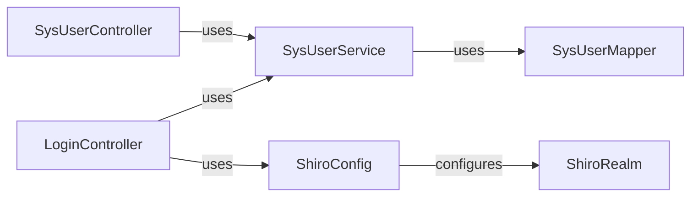

## Details

Spring Boot Demo System components and their relationships.

### LoginController
Handles user login requests and authentication.

**Related Classes/Methods**:

- `com.springboot.demo.controller.LoginController`

### SysUserController
Manages system user-related operations.

**Related Classes/Methods**:

- `com.springboot.demo.controller.SysUserController`

### SysUserService
Provides business logic for system user operations.

**Related Classes/Methods**:

- `com.springboot.demo.service.SysUserService`

### SysUserMapper
Data access layer for system user information.

**Related Classes/Methods**:

- `com.springboot.demo.mapper.SysUserMapper`

### ShiroConfig
Configures Apache Shiro for security.

**Related Classes/Methods**:

- `com.springboot.demo.config.ShiroConfig`

### ShiroRealm
Custom Shiro realm for authentication and authorization.

**Related Classes/Methods**:

- `com.springboot.demo.shiro.ShiroRealm`

### [FAQ](https://github.com/CodeBoarding/GeneratedOnBoardings/tree/main?tab=readme-ov-file#faq)