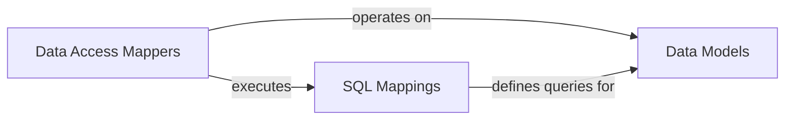

## Details

The data access layer of the `springboot-shiro` project is built upon a MyBatis framework, providing a clear separation of concerns for database interactions. At its foundation are the Data Models, which are Java POJOs (`SysUser`, `SysRole`, `SysMenu`) that precisely mirror the database schema, ensuring data integrity and type safety. Interacting with these models are the Data Access Mappers, Java interfaces (`SysUserMapper`, `SysRoleMapper`, `SysMenuMapper`) that define the contract for all database operations, abstracting away the underlying SQL complexities. The actual SQL logic is encapsulated within the SQL Mappings, a set of XML files (`SysUserMapper.xml`, `SysRoleMapper.xml`, `SysMenuMapper.xml`) that provide the concrete implementation for the mapper interfaces. This architecture ensures a maintainable and scalable data access solution where changes to the database schema or query logic can be managed efficiently within their respective components.

### Data Models
These are the foundational Java objects (`SysUser`, `SysRole`, `SysMenu`) that define the structure and types of data managed by the application. They serve as the blueprint for database tables and ensure data consistency across the application.

**Related Classes/Methods**:

- `com.springboot.demo.sys.entity.SysUser`
- `com.springboot.demo.sys.entity.SysRole`
- `com.springboot.demo.sys.entity.SysMenu`

### Data Access Mappers
These Java interfaces (`SysUserMapper`, `SysRoleMapper`, `SysMenuMapper`) provide an abstract layer for database operations. They define methods for performing CRUD (Create, Read, Update, Delete) operations on the `Data Models` without exposing the underlying SQL implementation details.

**Related Classes/Methods**:

- `com.springboot.demo.sys.mapper.SysUserMapper`
- `com.springboot.demo.sys.mapper.SysRoleMapper`
- `com.springboot.demo.sys.mapper.SysMenuMapper`

### SQL Mappings
These XML files (`SysUserMapper.xml`, `SysRoleMapper.xml`, `SysMenuMapper.xml`) contain the concrete SQL statements that implement the methods declared in the `Data Access Mappers`. MyBatis uses these files to execute database queries and map results back to the `Data Models`.

**Related Classes/Methods**:

- `SysUserMapper.xml`
- `SysRoleMapper.xml`
- `SysMenuMapper.xml`

### [FAQ](https://github.com/CodeBoarding/GeneratedOnBoardings/tree/main?tab=readme-ov-file#faq)