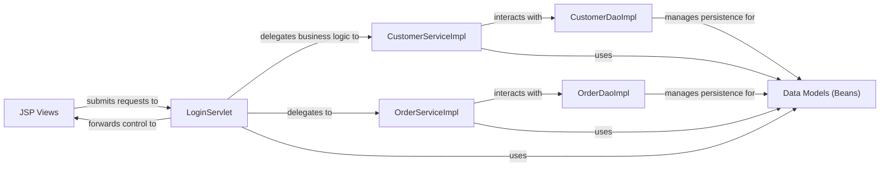

## Details

The eStore application follows a classic Model-View-Controller (MVC) pattern, albeit with a more traditional Java Servlet/JSP implementation. The `JSP Views` serve as the presentation layer, responsible for rendering the user interface and capturing user input. The `LoginServlet` acts as the central controller, handling incoming web requests, delegating business logic to the service layer, and managing navigation by forwarding to the appropriate JSP views. The `CustomerServiceImpl` and `OrderServiceImpl` components encapsulate the core business logic for customer and order management, respectively. These service components interact with their corresponding Data Access Objects (DAOs), `CustomerDaoImpl` and `OrderDaoImpl`, to persist and retrieve data from the underlying database. All layers heavily rely on the `Data Models (Beans)` to transfer data throughout the application.

### JSP Views
The user interface components responsible for rendering dynamic web pages, displaying product information, user forms (login, registration), and the shopping cart. They handle user input and present application data.

**Related Classes/Methods**:

- `/home/ubuntu/CodeBoarding/repo/Java/estore/WebContent/index.jsp`
- `/home/ubuntu/CodeBoarding/repo/Java/estore/WebContent/login.jsp`
- `/home/ubuntu/CodeBoarding/repo/Java/estore/WebContent/register.jsp`
- `/home/ubuntu/CodeBoarding/repo/Java/estore/WebContent/shopcart.jsp`

### LoginServlet
Acts as the primary controller for handling web requests related to user authentication and navigation. It receives HTTP requests, delegates business logic to the service layer, and manages the flow of control by forwarding to appropriate JSP views.

**Related Classes/Methods**:

- `com.briup.web.servlet.LoginServlet`

### CustomerServiceImpl
Implements the business logic for customer-related operations, including user registration, login validation, and managing customer profiles. It orchestrates interactions between the controller and the data access layer for customer data.

**Related Classes/Methods**:

- `com.briup.service.impl.CustomerServiceImpl`

### OrderServiceImpl
Implements the business logic for order processing, including managing the shopping cart, creating new orders, and calculating order totals. It coordinates with the data access layer for order persistence.

**Related Classes/Methods**:

- `com.briup.service.impl.OrderServiceImpl`

### CustomerDaoImpl
Provides data persistence operations for Customer entities. It abstracts direct database interactions, performing CRUD (Create, Read, Update, Delete) operations for customer data.

**Related Classes/Methods**:

- `com.briup.dao.impl.CustomerDaoImpl`

### OrderDaoImpl
Provides data persistence operations for Orderform entities. It abstracts direct database interactions, performing CRUD operations for order data.

**Related Classes/Methods**:

- `com.briup.dao.impl.OrderDaoImpl`

### Data Models (Beans)
A collection of Plain Old Java Objects (POJOs) representing the core entities of the eStore application, such as Book, Customer, and Orderform. These beans serve as data carriers between different layers of the application.

**Related Classes/Methods**:

- `com.briup.bean.Book`
- `com.briup.bean.Customer`
- `com.briup.bean.Orderform`

### [FAQ](https://github.com/CodeBoarding/GeneratedOnBoardings/tree/main?tab=readme-ov-file#faq)