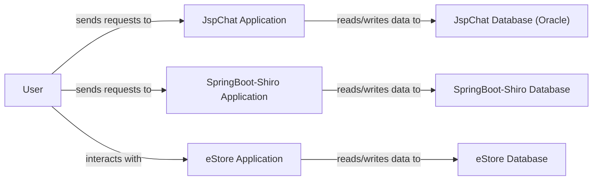

## Details

This architecture overview details the high-level components and their interactions across three distinct Java projects: JspChat, SpringBoot-Shiro, and eStore. The analysis focuses on identifying central modules and their data flow, optimized for both documentation and visual diagram generation. This multi-application system demonstrates three distinct web application architectures, each serving a specific purpose and operating independently while interacting with a common external "User" entity. The JspChat Application provides basic chat and file sharing, relying on JSP pages for presentation and direct database interaction for persistence. The SpringBoot-Shiro Application showcases a modern Spring Boot setup with robust security managed by Apache Shiro, utilizing a layered architecture with controllers, services, and mappers interacting with its database. The eStore Application functions as an e-commerce platform, built on a servlet-based architecture with clear separation of concerns into web, service, and DAO layers, persisting data in its dedicated database. Each application is designed to manage its own data and user interactions, providing a clear separation of concerns at the architectural level.

### User
An external entity representing end-users who interact with the web applications.

**Related Classes/Methods**: _None_

### JspChat Application [[Expand]](./JspChat_Application.md)
A traditional Java web application providing chat and file management functionalities. It handles user authentication, registration, and basic chat operations.

**Related Classes/Methods**:

- `JspChat/WebContent/Qqlogin.jsp`
- `JspChat/WebContent/document.jsp`
- `JspChat/WebContent/login.jsp`
- `JspChat/WebContent/register.jsp`
- `com.hjy.web.servlet.LoginServlet`

### SpringBoot-Shiro Application [[Expand]](./SpringBoot_Shiro_Application.md)
A Spring Boot application demonstrating robust security features using Apache Shiro for authentication and authorization. It manages user roles and permissions.

**Related Classes/Methods**:

- `com.springboot.demo.sys.controller.SysUserController`
- `com.springboot.demo.sys.controller.LoginController`
- `com.springboot.demo.common.auth.ShiroConfig`
- `com.springboot.demo.common.auth.ShiroRealm`
- `com.springboot.demo.sys.service.SysUserService`
- `com.springboot.demo.sys.mapper.SysUserMapper`

### eStore Application [[Expand]](./eStore_Application.md)
An e-commerce web application facilitating product browsing, cart management, and order processing.

**Related Classes/Methods**:

- `estore/WebContent/index.jsp`
- `estore/WebContent/login.jsp`
- `estore/WebContent/register.jsp`
- `estore/WebContent/shopcart.jsp`
- `com.briup.web.servlet.LoginServlet`
- `com.briup.service.impl.CustomerServiceImpl`
- `com.briup.service.impl.OrderServiceImpl`
- `com.briup.dao.impl.CustomerDaoImpl`
- `com.briup.dao.impl.OrderDaoImpl`
- `com.briup.bean.Book`
- `com.briup.bean.Customer`
- `com.briup.bean.Orderform`

### JspChat Database (Oracle)
The persistent storage for the JspChat Application, likely storing user credentials and chat-related data.

**Related Classes/Methods**: _None_

### SpringBoot-Shiro Database [[Expand]](./SpringBoot_Shiro_Database.md)
The persistent storage for the SpringBoot-Shiro Application, holding user accounts, roles, and permissions.

**Related Classes/Methods**: _None_

### eStore Database
The persistent storage for the eStore Application, containing product information, customer details, and order history.

**Related Classes/Methods**: _None_

### [FAQ](https://github.com/CodeBoarding/GeneratedOnBoardings/tree/main?tab=readme-ov-file#faq)