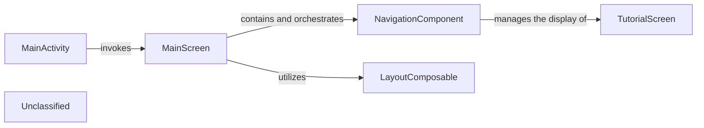

## Details

The application follows a Component-Based Architecture, centered around the `MainScreen` composable. The `MainActivity` serves as the application's entry point, launching the `MainScreen`. `MainScreen` then orchestrates the primary user interface, leveraging `LayoutComposable` for consistent structural elements and integrating the `NavigationComponent` to manage the flow between various `TutorialScreen`s. This design ensures a clear separation of concerns, with `MainActivity` handling application bootstrapping, `MainScreen` managing the top-level UI composition, `LayoutComposable` providing structural UI, `NavigationComponent` controlling navigation, and `TutorialScreen`s presenting specific content.

### MainScreen [[Expand]](./MainScreen.md)
The primary composable function that defines the main user interface of the application. It serves as the root UI container, orchestrating the overall application structure, including integrating the navigation system to display various tutorial examples. It embodies the "Component-Based Architecture" by composing the `NavigationComponent` and `LayoutComposable` to provide a consistent shell for the different `TutorialScreen`s.

**Related Classes/Methods**:

- <a href="https://github.com/Ahmedomarpro/Jetpack-Compose-Tutorials/blob/masterTutorial1-1Basics/src/main/java/com/smarttoolfactory/tutorial1_1basics/MainScreen.kt" target="_blank" rel="noopener noreferrer">`com.smarttoolfactory.tutorial1_1basics.MainScreen`</a>

### MainActivity
The application's entry point. It is responsible for launching the Jetpack Compose UI by setting the content view to the `MainScreen` composable, thereby initiating the entire UI hierarchy.

**Related Classes/Methods**:

- <a href="https://github.com/Ahmedomarpro/Jetpack-Compose-Tutorials/blob/masterTutorial1-1Basics/src/main/java/com/smarttoolfactory/tutorial1_1basics/MainActivity.kt" target="_blank" rel="noopener noreferrer">`com.smarttoolfactory.tutorial1_1basics.MainActivity`</a>

### NavigationComponent
Manages the UI flow and transitions between different screens within the application. It integrates and hosts the navigation system (e.g., `NavHost`), which then manages the display of various `TutorialScreen`s based on user interactions or programmatic navigation. This component is primarily implemented by `TutorialNavGraph`.

**Related Classes/Methods**:

- <a href="https://github.com/Ahmedomarpro/Jetpack-Compose-Tutorials/blob/masterTutorial1-1Basics/src/main/java/com/smarttoolfactory/tutorial1_1basics/TutorialNavGraph.kt" target="_blank" rel="noopener noreferrer">`com.smarttoolfactory.tutorial1_1basics.TutorialNavGraph`</a>

### TutorialScreen
Represents an individual tutorial or example UI. These are the specific content screens that the `NavigationComponent` displays, showcasing different UI patterns, composables, or functionalities. This is a conceptual component representing multiple concrete tutorial screen implementations within the project.

**Related Classes/Methods**:

- `TutorialScreen`

### LayoutComposable
Provides structural UI elements, such as `Scaffold`, which are utilized by `MainScreen` to structure its own content. These composables provide a consistent visual wrapper and define common UI areas like top bars, bottom navigation, or floating action buttons.

**Related Classes/Methods**:

### Unclassified
Component for all unclassified files and utility functions (Utility functions/External Libraries/Dependencies)

**Related Classes/Methods**: _None_

### [FAQ](https://github.com/CodeBoarding/GeneratedOnBoardings/tree/main?tab=readme-ov-file#faq)