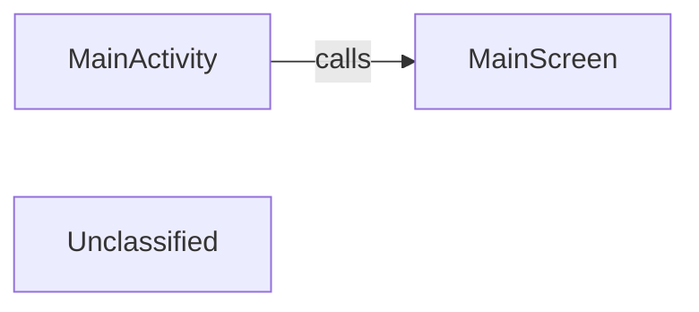

## Details

This graph represents the basic structure of an Android application using Jetpack Compose. The main flow starts with the MainActivity, which serves as the entry point of the application. It then calls the MainScreen composable, which is responsible for rendering the primary user interface. The purpose is to demonstrate a fundamental Compose application setup.

### MainActivity
The main entry point of the Android application, responsible for setting up the Compose environment.

**Related Classes/Methods**:

- `com.smarttoolfactory.tutorial1_1basics.MainActivity`
- `MainScreen`

### MainScreen [[Expand]](./MainScreen.md)
The primary composable function that defines the main user interface of the application.

**Related Classes/Methods**:

- `MainScreen`

### Unclassified
Component for all unclassified files and utility functions (Utility functions/External Libraries/Dependencies)

**Related Classes/Methods**: _None_

### [FAQ](https://github.com/CodeBoarding/GeneratedOnBoardings/tree/main?tab=readme-ov-file#faq)