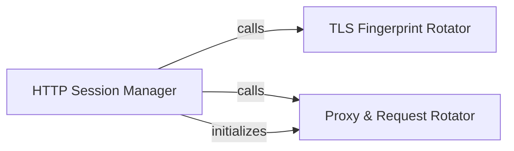

## Details

The HTTP Client & Proxy Manager subsystem is responsible for handling all network communication, ensuring stealth, reliability, and resilience against detection and blocking during web scraping operations. Its boundaries encompass the core functionalities related to HTTP session management, proxy rotation, and advanced request fingerprinting.

### HTTP Session Manager
Manages the creation, configuration, and lifecycle of HTTP sessions. It acts as the primary interface for initiating web requests, ensuring that underlying network settings and stealth mechanisms are properly applied.

**Related Classes/Methods**:

- <a href="https://github.com/speedyapply/JobSpy/blob/main/jobspy/util.py" target="_blank" rel="noopener noreferrer">`jobspy/util.py:create_session`</a>
- <a href="https://github.com/speedyapply/JobSpy/blob/main/jobspy/util.py" target="_blank" rel="noopener noreferrer">`jobspy/util.py:setup_session`</a>

### TLS Fingerprint Rotator
Implements mechanisms to rotate TLS fingerprints, mimicking various browser types and operating systems. This component is crucial for evading advanced bot detection systems that analyze TLS characteristics to identify automated clients.

**Related Classes/Methods**:

- <a href="https://github.com/speedyapply/JobSpy/blob/main/jobspy/util.py" target="_blank" rel="noopener noreferrer">`jobspy/util.py:TLSRotating`</a>

### Proxy & Request Rotator
Manages the rotation of proxies and other request-level attributes such as user agents. Its primary role is to distribute requests across multiple IP addresses and vary request headers to prevent IP blocking, rate limiting, and detection based on consistent request patterns.

**Related Classes/Methods**:

- <a href="https://github.com/speedyapply/JobSpy/blob/main/jobspy/util.py" target="_blank" rel="noopener noreferrer">`jobspy/util.py:RequestsRotating`</a>

### [FAQ](https://github.com/CodeBoarding/GeneratedOnBoardings/tree/main?tab=readme-ov-file#faq)