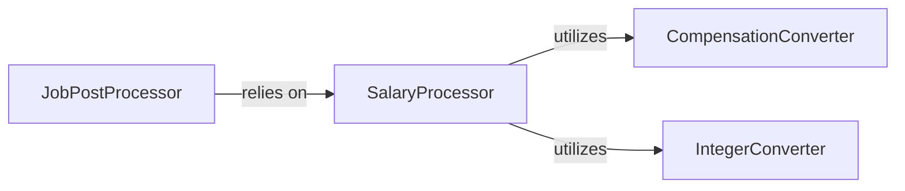

## Details

The Job Data Processor subsystem is responsible for transforming raw job data into a standardized JobPost schema, ensuring data consistency across all scraped entries. It handles tasks such as salary extraction, date parsing, and data type conversions.

### JobPostProcessor
The primary orchestrator within this subsystem for parsing and normalizing various attributes of a single job post. It takes raw scraped data and transforms it into a structured format, delegating specialized tasks to other components.

**Related Classes/Methods**:

- <a href="https://github.com/speedyapply/JobSpy/blob/main/jobspy/util.py" target="_blank" rel="noopener noreferrer">`JobPostProcessor._get_compensation`</a>

### SalaryProcessor
Specializes in extracting and standardizing salary information from diverse text formats. It handles the complexities of different compensation structures (e.g., hourly, monthly) and converts them into a consistent annual equivalent.

**Related Classes/Methods**:

- <a href="https://github.com/speedyapply/JobSpy/blob/main/jobspy/util.py" target="_blank" rel="noopener noreferrer">`SalaryProcessor.extract_salary`</a>

### CompensationConverter
Provides utility functions specifically for converting salary figures between different time units (e.g., hourly to annual, monthly to annual). It ensures consistency in compensation data.

**Related Classes/Methods**:

- <a href="https://github.com/speedyapply/JobSpy/blob/main/jobspy/util.py" target="_blank" rel="noopener noreferrer">`CompensationConverter.convert_hourly_to_annual`</a>
- <a href="https://github.com/speedyapply/JobSpy/blob/main/jobspy/util.py" target="_blank" rel="noopener noreferrer">`CompensationConverter.convert_monthly_to_annual`</a>

### IntegerConverter
A foundational utility component responsible for robustly converting string representations of numbers into integer types, crucial for numerical data extraction and processing within the subsystem.

**Related Classes/Methods**:

- <a href="https://github.com/speedyapply/JobSpy/blob/main/jobspy/util.py" target="_blank" rel="noopener noreferrer">`IntegerConverter.to_int`</a>

### [FAQ](https://github.com/CodeBoarding/GeneratedOnBoardings/tree/main?tab=readme-ov-file#faq)