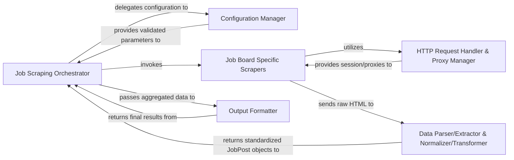

## Details

The `jobspy` project is designed as a modular web scraping system for job postings. Its core functionality revolves around the `Job Scraping Orchestrator`, which acts as the central control unit, coordinating the entire scraping workflow. This orchestrator leverages a `Configuration Manager` to interpret user inputs and a `HTTP Request Handler & Proxy Manager` for robust web interactions. Specialized `Job Board Specific Scrapers` handle the unique parsing logic for different job sites. The extracted raw data is then processed by `Data Parser/Extractor & Normalizer/Transformer` components to ensure consistency and adherence to a standardized schema. Finally, an `Output Formatter` prepares the aggregated and normalized job data for user consumption.

### Job Scraping Orchestrator [[Expand]](./Job_Scraping_Orchestrator.md)
The primary control component and public API entry point (`jobspy.scrape_jobs`). It is responsible for parsing input parameters, initializing the scraping process, coordinating individual job board scrapers, managing concurrency, and aggregating the final results into a structured format.

**Related Classes/Methods**:

- <a href="https://github.com/speedyapply/JobSpy/blob/main/jobspy/__init__.py#L31-L220" target="_blank" rel="noopener noreferrer">`jobspy.__init__.scrape_jobs`:31-220</a>

### Configuration Manager
Manages and interprets input parameters (e.g., keywords, location, job board filters, proxy settings) provided to the `scrape_jobs` function. It ensures parameters are correctly structured and accessible to relevant components, utilizing data models for validation and definition.

**Related Classes/Methods**:

- <a href="https://github.com/speedyapply/JobSpy/blob/main/jobspy/model.py#L10-L299" target="_blank" rel="noopener noreferrer">`jobspy.model`:10-299</a>
- <a href="https://github.com/speedyapply/JobSpy/blob/main/jobspy/util.py#L106-L132" target="_blank" rel="noopener noreferrer">`jobspy.util.create_session`:106-132</a>
- <a href="https://github.com/speedyapply/JobSpy/blob/main/jobspy/util.py#L135-L151" target="_blank" rel="noopener noreferrer">`jobspy.util.set_logger_level`:135-151</a>

### Job Board Specific Scrapers
A collection of specialized modules, each designed to scrape job data from a particular job board (e.g., LinkedIn, Indeed, Glassdoor). They encapsulate the unique logic for navigating, sending requests, parsing HTML, and extracting raw data from their respective websites.

**Related Classes/Methods**:

- <a href="https://github.com/speedyapply/JobSpy/blob/main/jobspy/linkedin#L1-L10000" target="_blank" rel="noopener noreferrer">`jobspy.linkedin`:1-10000</a>
- <a href="https://github.com/speedyapply/JobSpy/blob/main/jobspy/indeed#L1-L10000" target="_blank" rel="noopener noreferrer">`jobspy.indeed`:1-10000</a>
- <a href="https://github.com/speedyapply/JobSpy/blob/main/jobspy/glassdoor#L1-L10000" target="_blank" rel="noopener noreferrer">`jobspy.glassdoor`:1-10000</a>
- <a href="https://github.com/speedyapply/JobSpy/blob/main/jobspy/google#L1-L10000" target="_blank" rel="noopener noreferrer">`jobspy.google`:1-10000</a>
- <a href="https://github.com/speedyapply/JobSpy/blob/main/jobspy/bayt#L1-L10000" target="_blank" rel="noopener noreferrer">`jobspy.bayt`:1-10000</a>
- <a href="https://github.com/speedyapply/JobSpy/blob/main/jobspy/naukri#L1-L10000" target="_blank" rel="noopener noreferrer">`jobspy.naukri`:1-10000</a>
- <a href="https://github.com/speedyapply/JobSpy/blob/main/jobspy/bdjobs#L1-L10000" target="_blank" rel="noopener noreferrer">`jobspy.bdjobs`:1-10000</a>
- <a href="https://github.com/speedyapply/JobSpy/blob/main/jobspy/ziprecruiter#L1-L10000" target="_blank" rel="noopener noreferrer">`jobspy.ziprecruiter`:1-10000</a>

### HTTP Request Handler & Proxy Manager
Manages all HTTP requests made during the scraping process, handling session creation, retries, timeouts, and integrating proxy rotation. This component ensures robust, anonymous, and efficient communication with job board websites.

**Related Classes/Methods**:

- <a href="https://github.com/speedyapply/JobSpy/blob/main/jobspy/util.py#L106-L132" target="_blank" rel="noopener noreferrer">`jobspy.util.create_session`:106-132</a>
- <a href="https://github.com/speedyapply/JobSpy/blob/main/jobspy/util.py#L32-L52" target="_blank" rel="noopener noreferrer">`jobspy.util.RotatingProxySession`:32-52</a>
- <a href="https://github.com/speedyapply/JobSpy/blob/main/jobspy/util.py#L55-L86" target="_blank" rel="noopener noreferrer">`jobspy.util.RequestsRotating`:55-86</a>
- <a href="https://github.com/speedyapply/JobSpy/blob/main/jobspy/util.py#L89-L103" target="_blank" rel="noopener noreferrer">`jobspy.util.TLSRotating`:89-103</a>

### Data Parser/Extractor & Normalizer/Transformer
Responsible for parsing raw HTML content from job boards, extracting structured job post data, and then normalizing/transforming this data to conform to a standardized `JobPost` schema. This includes cleaning, standardizing formats, and enriching data points like salary and job type.

**Related Classes/Methods**:

- <a href="https://github.com/speedyapply/JobSpy/blob/main/jobspy/model.py#L239-L281" target="_blank" rel="noopener noreferrer">`jobspy.model.JobPost`:239-281</a>
- <a href="https://github.com/speedyapply/JobSpy/blob/main/jobspy/util.py#L154-L158" target="_blank" rel="noopener noreferrer">`jobspy.util.markdown_converter`:154-158</a>
- <a href="https://github.com/speedyapply/JobSpy/blob/main/jobspy/util.py#L161-L165" target="_blank" rel="noopener noreferrer">`jobspy.util.extract_emails_from_text`:161-165</a>
- <a href="https://github.com/speedyapply/JobSpy/blob/main/jobspy/util.py#L179-L193" target="_blank" rel="noopener noreferrer">`jobspy.util.currency_parser`:179-193</a>
- <a href="https://github.com/speedyapply/JobSpy/blob/main/jobspy/util.py#L202-L269" target="_blank" rel="noopener noreferrer">`jobspy.util.extract_salary`:202-269</a>
- <a href="https://github.com/speedyapply/JobSpy/blob/main/jobspy/util.py#L272-L288" target="_blank" rel="noopener noreferrer">`jobspy.util.extract_job_type`:272-288</a>

### Output Formatter
Takes the aggregated and normalized `JobPost` data and formats it into various output formats as requested by the user (e.g., Pandas DataFrame, JSON, CSV). It utilizes the `JobResponse` model to structure the final output.

**Related Classes/Methods**:

- <a href="https://github.com/speedyapply/JobSpy/blob/main/jobspy/__init__.py#L31-L220" target="_blank" rel="noopener noreferrer">`jobspy.__init__.scrape_jobs`:31-220</a>
- <a href="https://github.com/speedyapply/JobSpy/blob/main/jobspy/model.py#L283-L284" target="_blank" rel="noopener noreferrer">`jobspy.model.JobResponse`:283-284</a>

### [FAQ](https://github.com/CodeBoarding/GeneratedOnBoardings/tree/main?tab=readme-ov-file#faq)