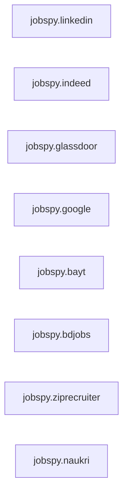

## Details

One paragraph explaining the functionality which is represented by this graph. What the main flow is and what is its purpose.

### jobspy.linkedin
Encapsulates the scraping logic for LinkedIn, with its `scrape` function orchestrating data fetching, parsing, and site-specific adaptations, supported by various internal helper functions.

**Related Classes/Methods**:

- <a href="https://github.com/speedyapply/JobSpy/blob/main/jobspy/linkedin/__init__.py" target="_blank" rel="noopener noreferrer">`jobspy.linkedin:scrape`</a>
- <a href="https://github.com/speedyapply/JobSpy/blob/main/jobspy/linkedin/__init__.py" target="_blank" rel="noopener noreferrer">`jobspy.linkedin:_fetch_jobs`</a>
- <a href="https://github.com/speedyapply/JobSpy/blob/main/jobspy/linkedin/__init__.py" target="_blank" rel="noopener noreferrer">`jobspy.linkedin:_parse_job`</a>
- <a href="https://github.com/speedyapply/JobSpy/blob/main/jobspy/linkedin/__init__.py" target="_blank" rel="noopener noreferrer">`jobspy.linkedin:_extract_job_info`</a>
- <a href="https://github.com/speedyapply/JobSpy/blob/main/jobspy/linkedin/__init__.py" target="_blank" rel="noopener noreferrer">`jobspy.linkedin:_get_job_details`</a>

### jobspy.indeed
Encapsulates the scraping logic for Indeed, with its `scrape` function orchestrating data fetching, parsing, and site-specific adaptations, supported by various internal helper functions.

**Related Classes/Methods**:

- <a href="https://github.com/speedyapply/JobSpy/blob/main/jobspy/indeed/__init__.py" target="_blank" rel="noopener noreferrer">`jobspy.indeed:scrape`</a>
- <a href="https://github.com/speedyapply/JobSpy/blob/main/jobspy/indeed/__init__.py" target="_blank" rel="noopener noreferrer">`jobspy.indeed:_fetch_jobs`</a>
- <a href="https://github.com/speedyapply/JobSpy/blob/main/jobspy/indeed/__init__.py" target="_blank" rel="noopener noreferrer">`jobspy.indeed:_parse_job`</a>
- <a href="https://github.com/speedyapply/JobSpy/blob/main/jobspy/indeed/__init__.py" target="_blank" rel="noopener noreferrer">`jobspy.indeed:_extract_job_info`</a>
- <a href="https://github.com/speedyapply/JobSpy/blob/main/jobspy/indeed/__init__.py" target="_blank" rel="noopener noreferrer">`jobspy.indeed:_get_job_details`</a>

### jobspy.glassdoor
Encapsulates the scraping logic for Glassdoor, with its `scrape` function orchestrating data fetching, parsing, and site-specific adaptations, supported by various internal helper functions.

**Related Classes/Methods**:

- <a href="https://github.com/speedyapply/JobSpy/blob/main/jobspy/glassdoor/__init__.py" target="_blank" rel="noopener noreferrer">`jobspy.glassdoor:scrape`</a>
- <a href="https://github.com/speedyapply/JobSpy/blob/main/jobspy/glassdoor/__init__.py" target="_blank" rel="noopener noreferrer">`jobspy.glassdoor:_fetch_jobs`</a>
- <a href="https://github.com/speedyapply/JobSpy/blob/main/jobspy/glassdoor/__init__.py" target="_blank" rel="noopener noreferrer">`jobspy.glassdoor:_parse_job`</a>
- <a href="https://github.com/speedyapply/JobSpy/blob/main/jobspy/glassdoor/__init__.py" target="_blank" rel="noopener noreferrer">`jobspy.glassdoor:_extract_job_info`</a>
- <a href="https://github.com/speedyapply/JobSpy/blob/main/jobspy/glassdoor/__init__.py" target="_blank" rel="noopener noreferrer">`jobspy.glassdoor:_get_job_details`</a>

### jobspy.google
Encapsulates the scraping logic for Google, with its `scrape` function orchestrating data fetching, parsing, and site-specific adaptations, supported by various internal helper functions.

**Related Classes/Methods**:

- <a href="https://github.com/speedyapply/JobSpy/blob/main/jobspy/google/__init__.py" target="_blank" rel="noopener noreferrer">`jobspy.google:scrape`</a>
- <a href="https://github.com/speedyapply/JobSpy/blob/main/jobspy/google/__init__.py" target="_blank" rel="noopener noreferrer">`jobspy.google:_fetch_jobs`</a>
- <a href="https://github.com/speedyapply/JobSpy/blob/main/jobspy/google/__init__.py" target="_blank" rel="noopener noreferrer">`jobspy.google:_parse_job`</a>
- <a href="https://github.com/speedyapply/JobSpy/blob/main/jobspy/google/__init__.py" target="_blank" rel="noopener noreferrer">`jobspy.google:_extract_job_info`</a>
- <a href="https://github.com/speedyapply/JobSpy/blob/main/jobspy/google/__init__.py" target="_blank" rel="noopener noreferrer">`jobspy.google:_get_job_details`</a>

### jobspy.bayt
Encapsulates the scraping logic for Bayt, with its `scrape` function orchestrating data fetching, parsing, and site-specific adaptations, supported by various internal helper functions.

**Related Classes/Methods**:

- <a href="https://github.com/speedyapply/JobSpy/blob/main/jobspy/bayt/__init__.py" target="_blank" rel="noopener noreferrer">`jobspy.bayt:scrape`</a>
- <a href="https://github.com/speedyapply/JobSpy/blob/main/jobspy/bayt/__init__.py" target="_blank" rel="noopener noreferrer">`jobspy.bayt:_fetch_jobs`</a>
- <a href="https://github.com/speedyapply/JobSpy/blob/main/jobspy/bayt/__init__.py" target="_blank" rel="noopener noreferrer">`jobspy.bayt:_parse_job`</a>
- <a href="https://github.com/speedyapply/JobSpy/blob/main/jobspy/bayt/__init__.py" target="_blank" rel="noopener noreferrer">`jobspy.bayt:_extract_job_info`</a>
- <a href="https://github.com/speedyapply/JobSpy/blob/main/jobspy/bayt/__init__.py" target="_blank" rel="noopener noreferrer">`jobspy.bayt:_get_job_details`</a>

### jobspy.bdjobs
Encapsulates the scraping logic for Bdjobs, with its `scrape` function orchestrating data fetching, parsing, and site-specific adaptations, supported by various internal helper functions.

**Related Classes/Methods**:

- <a href="https://github.com/speedyapply/JobSpy/blob/main/jobspy/bdjobs/__init__.py" target="_blank" rel="noopener noreferrer">`jobspy.bdjobs:scrape`</a>
- <a href="https://github.com/speedyapply/JobSpy/blob/main/jobspy/bdjobs/__init__.py" target="_blank" rel="noopener noreferrer">`jobspy.bdjobs:_fetch_jobs`</a>
- <a href="https://github.com/speedyapply/JobSpy/blob/main/jobspy/bdjobs/__init__.py" target="_blank" rel="noopener noreferrer">`jobspy.bdjobs:_parse_job`</a>
- <a href="https://github.com/speedyapply/JobSpy/blob/main/jobspy/bdjobs/__init__.py" target="_blank" rel="noopener noreferrer">`jobspy.bdjobs:_extract_job_info`</a>
- <a href="https://github.com/speedyapply/JobSpy/blob/main/jobspy/bdjobs/__init__.py" target="_blank" rel="noopener noreferrer">`jobspy.bdjobs:_get_job_details`</a>

### jobspy.ziprecruiter
Encapsulates the scraping logic for Ziprecruiter, with its `scrape` function orchestrating data fetching, parsing, and site-specific adaptations, supported by various internal helper functions.

**Related Classes/Methods**:

- <a href="https://github.com/speedyapply/JobSpy/blob/main/jobspy/ziprecruiter/__init__.py" target="_blank" rel="noopener noreferrer">`jobspy.ziprecruiter:scrape`</a>
- <a href="https://github.com/speedyapply/JobSpy/blob/main/jobspy/ziprecruiter/__init__.py" target="_blank" rel="noopener noreferrer">`jobspy.ziprecruiter:_fetch_jobs`</a>
- <a href="https://github.com/speedyapply/JobSpy/blob/main/jobspy/ziprecruiter/__init__.py" target="_blank" rel="noopener noreferrer">`jobspy.ziprecruiter:_parse_job`</a>
- <a href="https://github.com/speedyapply/JobSpy/blob/main/jobspy/ziprecruiter/__init__.py" target="_blank" rel="noopener noreferrer">`jobspy.ziprecruiter:_extract_job_info`</a>
- <a href="https://github.com/speedyapply/JobSpy/blob/main/jobspy/ziprecruiter/__init__.py" target="_blank" rel="noopener noreferrer">`jobspy.ziprecruiter:_get_job_details`</a>

### jobspy.naukri
Encapsulates the scraping logic for Naukri, with its `scrape` function orchestrating data fetching, parsing, and site-specific adaptations, supported by various internal helper functions.

**Related Classes/Methods**:

- <a href="https://github.com/speedyapply/JobSpy/blob/main/jobspy/naukri/__init__.py" target="_blank" rel="noopener noreferrer">`jobspy.naukri:scrape`</a>
- <a href="https://github.com/speedyapply/JobSpy/blob/main/jobspy/naukri/__init__.py" target="_blank" rel="noopener noreferrer">`jobspy.naukri:_fetch_jobs`</a>
- <a href="https://github.com/speedyapply/JobSpy/blob/main/jobspy/naukri/__init__.py" target="_blank" rel="noopener noreferrer">`jobspy.naukri:_parse_job`</a>
- <a href="https://github.com/speedyapply/JobSpy/blob/main/jobspy/naukri/__init__.py" target="_blank" rel="noopener noreferrer">`jobspy.naukri:_extract_job_info`</a>
- <a href="https://github.com/speedyapply/JobSpy/blob/main/jobspy/naukri/__init__.py" target="_blank" rel="noopener noreferrer">`jobspy.naukri:_get_job_details`</a>

### [FAQ](https://github.com/CodeBoarding/GeneratedOnBoardings/tree/main?tab=readme-ov-file#faq)