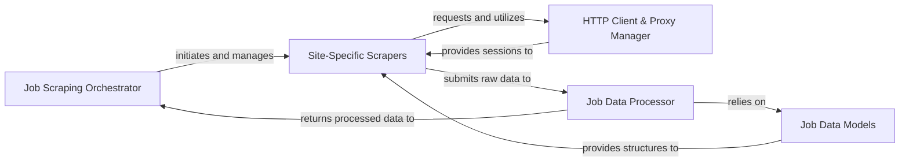

## Details

The jobspy project is structured around a clear data flow for scraping job postings from various online sources. The Job Scraping Orchestrator acts as the central entry point, coordinating the entire process. It dispatches requests to Site-Specific Scrapers, each tailored to extract data from a particular job board. These scrapers leverage the HTTP Client & Proxy Manager for robust and stealthy web requests. Once raw data is obtained, it's passed to the Job Data Processor, which standardizes the information into a consistent format defined by the Job Data Models. Finally, the processed and structured job data is returned to the Job Scraping Orchestrator, completing the scraping lifecycle. This modular design ensures maintainability, scalability, and clear separation of concerns, making it suitable for both detailed documentation and intuitive visual diagram generation.

### Job Scraping Orchestrator [[Expand]](./Job_Scraping_Orchestrator.md)
The primary control component responsible for initiating, coordinating, and aggregating results from the entire job scraping workflow. It serves as the public API entry point.

**Related Classes/Methods**:

- <a href="https://github.com/speedyapply/JobSpy/blob/main/jobspy/__init__.py" target="_blank" rel="noopener noreferrer">`jobspy/__init__.py:scrape_jobs`</a>

### Site-Specific Scrapers [[Expand]](./Site_Specific_Scrapers.md)
A collection of specialized modules, each encapsulating the unique logic required to scrape data from a specific job board (e.g., LinkedIn, Indeed, Glassdoor). They are responsible for navigating, extracting, and initially parsing raw job information.

**Related Classes/Methods**:

- <a href="https://github.com/speedyapply/JobSpy/blob/main/jobspy/linkedin/__init__.py" target="_blank" rel="noopener noreferrer">`jobspy/linkedin.py`</a>
- <a href="https://github.com/speedyapply/JobSpy/blob/main/jobspy/indeed/__init__.py" target="_blank" rel="noopener noreferrer">`jobspy/indeed.py`</a>
- <a href="https://github.com/speedyapply/JobSpy/blob/main/jobspy/glassdoor/__init__.py" target="_blank" rel="noopener noreferrer">`jobspy/glassdoor.py`</a>
- <a href="https://github.com/speedyapply/JobSpy/blob/main/jobspy/google/__init__.py" target="_blank" rel="noopener noreferrer">`jobspy/google.py`</a>
- <a href="https://github.com/speedyapply/JobSpy/blob/main/jobspy/bayt/__init__.py" target="_blank" rel="noopener noreferrer">`jobspy/bayt.py`</a>
- <a href="https://github.com/speedyapply/JobSpy/blob/main/jobspy/bdjobs/__init__.py" target="_blank" rel="noopener noreferrer">`jobspy/bdjobs.py`</a>
- <a href="https://github.com/speedyapply/JobSpy/blob/main/jobspy/ziprecruiter/__init__.py" target="_blank" rel="noopener noreferrer">`jobspy/ziprecruiter.py`</a>
- <a href="https://github.com/speedyapply/JobSpy/blob/main/jobspy/naukri/__init__.py" target="_blank" rel="noopener noreferrer">`jobspy/naukri.py`</a>

### HTTP Client & Proxy Manager [[Expand]](./HTTP_Client_Proxy_Manager.md)
Manages network sessions, proxy rotation, and advanced HTTP features (like TLS fingerprinting) to ensure reliable and stealthy web requests, minimizing detection and blocking.

**Related Classes/Methods**:

- <a href="https://github.com/speedyapply/JobSpy/blob/main/jobspy/util.py" target="_blank" rel="noopener noreferrer">`jobspy/util.py:create_session`</a>
- <a href="https://github.com/speedyapply/JobSpy/blob/main/jobspy/util.py" target="_blank" rel="noopener noreferrer">`jobspy/util.py:setup_session`</a>
- <a href="https://github.com/speedyapply/JobSpy/blob/main/jobspy/util.py" target="_blank" rel="noopener noreferrer">`jobspy/util.py:TLSRotating`</a>
- <a href="https://github.com/speedyapply/JobSpy/blob/main/jobspy/util.py" target="_blank" rel="noopener noreferrer">`jobspy/util.py:RequestsRotating`</a>

### Job Data Processor [[Expand]](./Job_Data_Processor.md)
Transforms raw job data from various sources into a standardized JobPost schema, handling tasks like salary extraction, date parsing, and data type conversions. It ensures data consistency across all scraped entries.

**Related Classes/Methods**:

- <a href="https://github.com/speedyapply/JobSpy/blob/main/jobspy/util.py" target="_blank" rel="noopener noreferrer">`jobspy/util.py:extract_salary`</a>
- <a href="https://github.com/speedyapply/JobSpy/blob/main/jobspy/util.py" target="_blank" rel="noopener noreferrer">`jobspy/util.py:convert_to_annual`</a>
- <a href="https://github.com/speedyapply/JobSpy/blob/main/jobspy/util.py" target="_blank" rel="noopener noreferrer">`jobspy/util.py:to_int`</a>

### Job Data Models
Defines the canonical data structures (Pydantic models) for representing job postings, scraper inputs, and related enumerations, ensuring a consistent data contract throughout the system.

**Related Classes/Methods**:

- <a href="https://github.com/speedyapply/JobSpy/blob/main/jobspy/model.py" target="_blank" rel="noopener noreferrer">`jobspy/model.py:JobResponse`</a>
- <a href="https://github.com/speedyapply/JobSpy/blob/main/jobspy/model.py" target="_blank" rel="noopener noreferrer">`jobspy/model.py:ScraperInput`</a>
- <a href="https://github.com/speedyapply/JobSpy/blob/main/jobspy/model.py" target="_blank" rel="noopener noreferrer">`jobspy/model.py:JobType`</a>
- <a href="https://github.com/speedyapply/JobSpy/blob/main/jobspy/model.py" target="_blank" rel="noopener noreferrer">`jobspy/model.py:Site`</a>
- <a href="https://github.com/speedyapply/JobSpy/blob/main/jobspy/model.py" target="_blank" rel="noopener noreferrer">`jobspy/model.py:Country`</a>

### [FAQ](https://github.com/CodeBoarding/GeneratedOnBoardings/tree/main?tab=readme-ov-file#faq)