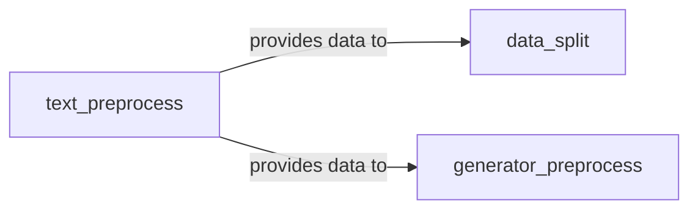

## Details

The Data Pipeline subsystem is encapsulated within the `keras_textclassification.data_preprocess` package, involving `data_split`, `generator_preprocess`, and `text_preprocess` modules. It exhibits a clear sequential flow, characteristic of a Pipeline Pattern, handling initial raw data ingestion, cleaning, conversion, data partitioning, and preparation for Keras data generators.

### text_preprocess
Acts as the initial data ingestion and transformation component. It reads raw text, extracts relevant content (e.g., Chinese characters), converts textual labels and questions into numerical indices, and manages the persistence of mappings (saving/loading JSON for vocabulary and label mappings). This component handles the core cleaning, tokenization, and numerical conversion steps.

**Related Classes/Methods**:

- <a href="https://github.com/yongzhuo/Keras-TextClassification/blob/master/keras_textclassification/data_preprocess/text_preprocess.py" target="_blank" rel="noopener noreferrer">`keras_textclassification.data_preprocess.text_preprocess`</a>

### data_split
Manages the crucial task of dividing the processed dataset into training and validation subsets, ensuring proper model evaluation and preventing overfitting. It handles the partitioning of the data after initial preprocessing.

**Related Classes/Methods**:

- <a href="https://github.com/yongzhuo/Keras-TextClassification/blob/master/keras_textclassification/data_preprocess/data_split.py" target="_blank" rel="noopener noreferrer">`keras_textclassification.data_preprocess.data_split`</a>

### generator_preprocess
Specializes in preparing data for efficient, on-the-fly loading during model training using Keras data generators. It takes the numerically processed data and further transforms it (e.g., converting labels/questions into an indexed format) to be consumed by Keras's `fit_generator` or `fit` methods. This component optimizes data flow for training efficiency.

**Related Classes/Methods**:

- <a href="https://github.com/yongzhuo/Keras-TextClassification/blob/master/keras_textclassification/data_preprocess/generator_preprocess.py" target="_blank" rel="noopener noreferrer">`keras_textclassification.data_preprocess.generator_preprocess`</a>

### [FAQ](https://github.com/CodeBoarding/GeneratedOnBoardings/tree/main?tab=readme-ov-file#faq)