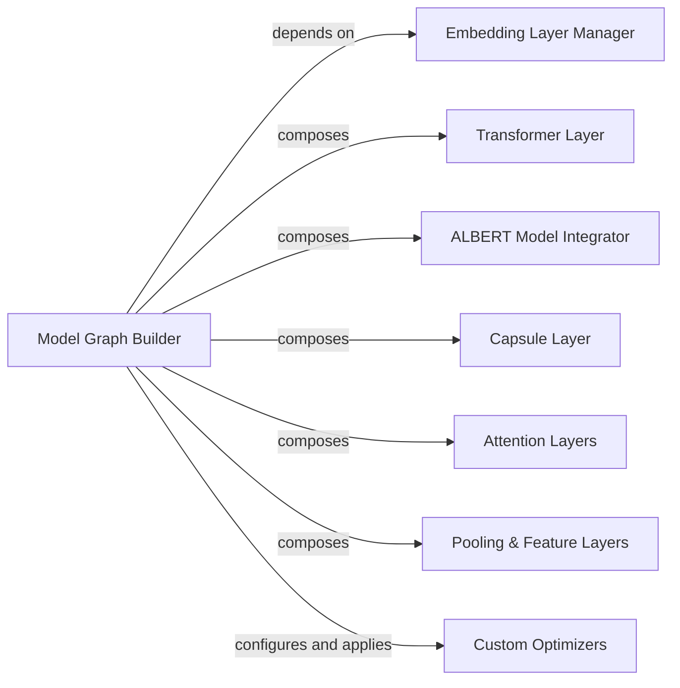

## Details

The `Model Building Blocks` subsystem provides the foundational elements for constructing various text classification models within the Keras framework. It encapsulates core utilities for data representation, graph definition, and a rich set of specialized custom layers and optimizers.

### Embedding Layer Manager
Manages the creation and configuration of embedding layers, converting raw text into numerical representations suitable for model input. It handles the initial data preparation for the neural network.

**Related Classes/Methods**:

- <a href="https://github.com/yongzhuo/Keras-TextClassification/blob/master/keras_textclassification/base/embedding.py#L1-L100" target="_blank" rel="noopener noreferrer">`keras_textclassification.base.embedding`:1-100</a>

### Model Graph Builder
Serves as the central orchestrator for high-level model building, compilation, and training processes. It defines the overall structure of Keras models by integrating various custom layers and pre-trained model components.

**Related Classes/Methods**:

- <a href="https://github.com/yongzhuo/Keras-TextClassification/blob/master/keras_textclassification/base/graph.py#L1-L100" target="_blank" rel="noopener noreferrer">`keras_textclassification.base.graph`:1-100</a>

### Transformer Layer
Implements the core logic for Transformer encoder and decoder stacks, including multi-head attention mechanisms. It provides a reusable and configurable Transformer architecture.

**Related Classes/Methods**:

- <a href="https://github.com/yongzhuo/Keras-TextClassification/blob/master/keras_textclassification/keras_layers/transformer.py#L1-L100" target="_blank" rel="noopener noreferrer">`keras_textclassification.keras_layers.transformer`:1-100</a>
- <a href="https://github.com/yongzhuo/Keras-TextClassification/blob/master/keras_textclassification/keras_layers/transformer_utils/multi_head_attention.py#L1-L100" target="_blank" rel="noopener noreferrer">`keras_textclassification.keras_layers.transformer_utils.multi_head_attention`:1-100</a>

### ALBERT Model Integrator
Facilitates the integration of ALBERT models into the Keras framework, including managing the construction and loading of pre-trained weights.

**Related Classes/Methods**:

- <a href="https://github.com/yongzhuo/Keras-TextClassification/blob/master/keras_textclassification/keras_layers/albert/albert.py#L1-L100" target="_blank" rel="noopener noreferrer">`keras_textclassification.keras_layers.albert.albert`:1-100</a>

### Capsule Layer
Implements the unique logic of a Capsule layer, including its `squash` activation function, offering an alternative to traditional convolutional layers for hierarchical feature learning.

**Related Classes/Methods**:

- <a href="https://github.com/yongzhuo/Keras-TextClassification/blob/master/keras_textclassification/keras_layers/capsule.py#L1-L100" target="_blank" rel="noopener noreferrer">`keras_textclassification.keras_layers.capsule`:1-100</a>

### Attention Layers
Provide various attention mechanisms, such as self-attention and dot-product attention, which are crucial for capturing dependencies within sequences.

**Related Classes/Methods**:

- <a href="https://github.com/yongzhuo/Keras-TextClassification/blob/master/keras_textclassification/keras_layers/attention_self.py#L1-L100" target="_blank" rel="noopener noreferrer">`keras_textclassification.keras_layers.attention_self`:1-100</a>
- <a href="https://github.com/yongzhuo/Keras-TextClassification/blob/master/keras_textclassification/keras_layers/attention_dot.py#L1-L100" target="_blank" rel="noopener noreferrer">`keras_textclassification.keras_layers.attention_dot`:1-100</a>

### Pooling & Feature Layers
Offer specialized operations for feature selection (K-Max Pooling), non-linear transformations (Highway networks), and utilities for handling masks in recurrent or attention-based networks.

**Related Classes/Methods**:

- <a href="https://github.com/yongzhuo/Keras-TextClassification/blob/master/keras_textclassification/keras_layers/k_max_pooling.py#L1-L100" target="_blank" rel="noopener noreferrer">`keras_textclassification.keras_layers.k_max_pooling`:1-100</a>
- <a href="https://github.com/yongzhuo/Keras-TextClassification/blob/master/keras_textclassification/keras_layers/highway.py#L1-L100" target="_blank" rel="noopener noreferrer">`keras_textclassification.keras_layers.highway`:1-100</a>
- <a href="https://github.com/yongzhuo/Keras-TextClassification/blob/master/keras_textclassification/keras_layers/non_mask_layer.py#L1-L100" target="_blank" rel="noopener noreferrer">`keras_textclassification.keras_layers.non_mask_layer`:1-100</a>

### Custom Optimizers
Provide advanced optimization algorithms (e.g., Lookahead, RAdam) that can improve the training stability and performance of Keras models.

**Related Classes/Methods**:

- <a href="https://github.com/yongzhuo/Keras-TextClassification/blob/master/keras_textclassification/keras_layers/keras_lookahead.py#L1-L100" target="_blank" rel="noopener noreferrer">`keras_textclassification.keras_layers.keras_lookahead`:1-100</a>
- <a href="https://github.com/yongzhuo/Keras-TextClassification/blob/master/keras_textclassification/keras_layers/keras_radam.py#L1-L100" target="_blank" rel="noopener noreferrer">`keras_textclassification.keras_layers.keras_radam`:1-100</a>

### [FAQ](https://github.com/CodeBoarding/GeneratedOnBoardings/tree/main?tab=readme-ov-file#faq)